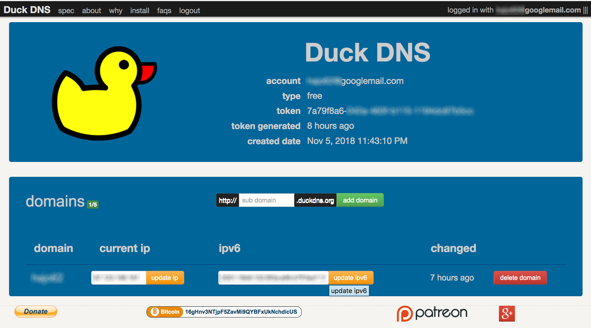

# Projekt Home Automation

## Wie es begann
Im Herbst 2017 hatte ich mich für Home Automation mit dem Hauptziel der Steuerung mehrerer Heizkörper in meiner angemieteten Wohnung interessiert. Um nicht erst nach Ende der Heizsaison fertig zu sein, habe ich zuerst nach einer fertigen Lösung gesucht und mich für [homee](https://hom.ee/) entschieden.

Im Herbst 2018 habe ich nun begonnen, an einer Raspberry Pi basierte Lösung zu *basteln*.

## Vorarbeiten
### Heimnetz von außen erreichbar machen
#### DS-Lite-Tunnel
Mein Internet-Provider [1&amp;1](http://www.1und1.de/) hatte meinen DSL-Anschluss vor einiger Zeit auf einen  [DS-Lite-Tunnel](https://de.wikipedia.org/wiki/IPv6#Dual-Stack_Lite_(DS-Lite)) umgestellt. Dadurch wurde meinem Anschluss keine IPv4-IP-Adresse mehr zugeteilt und ein im Heimnetz betriebener Rechner ist von außen nicht über das IPv4-Netz erreichbar. Da die 4in6-Tunnel-Anbieter **sixXS** oder **gogo6** ihre Dienste eingestellt haben, scheinen solche Tunnel nicht mehr verfügbar zu sein.

Erstaunlicherweise genügte aber ein Anruf bei der Hotline (+49 721 9600) und mein Anschluss wurde nach wenigen Minuten auf einen _vollen_ DSL-Anschluss mit dynamischer IPv4-Adresse umgestellt.

### DynDNS

Da meinem DSL-Anschluss keine feste IP-Adresse zugeordnet ist und diese sich jede Nacht ändern könnte, ist es notwendig, meinem Netz über dynDNS einen festen Domain-Namen zuzuweisen (&quot;Dynamic Updates in the Domain Name System (DNS UPDATE)&quot;.

Hier bieten sich mehrere Möglichkeiten (mit welchen Vor- bzw-Nachteilen?):

#### dynDNS der Fritzbox

Unter `Internet / My!FRITZ-Konto` muss ein **MyFRITZ!-Konto** eingerichtet und anschließend die Option **MyFRITZ!-Internetzugriff** aktiviert werden.

#### dynDNS von Internetanbietern

Der Anbieter [DuckDNS](http://duckdns.org) ist kostenlos und man sich ohne einen neuen Account anlegen zu müssen, einfach mit seiner googlemail-Adresse anmelden.

Nun einfach eine Domain (z.B. https://mydomain.duckdns.org) erzeugen und die IPv4- und/oder IPv6-Adresse eintragen. Anschließend kann man die Verbindung mit `ping mydomain.duckdns.org` prüfen.

Damit sich ändernde IP-Adressen dem dynDNS-Dienst bekannt gegeben werden, muss in der Fritzbox unter Internet / Freigaben / DynDNS noch die Update-Url (z.B.

`https://www.duckdns.org/update?domains=mydomain.duckdns.org&token=token-von-dyndns&ip=<ipaddr>&ipv6=<ip6addr>`) hinterlegt werden.
[Hier](https://8300111.de/fritzbox-mit-os-6-60-dynamic-dns-mit-duck-dns-einrichten-schnell-und-kostenlos) findet sich dazu eine kurze Beschreibung.
