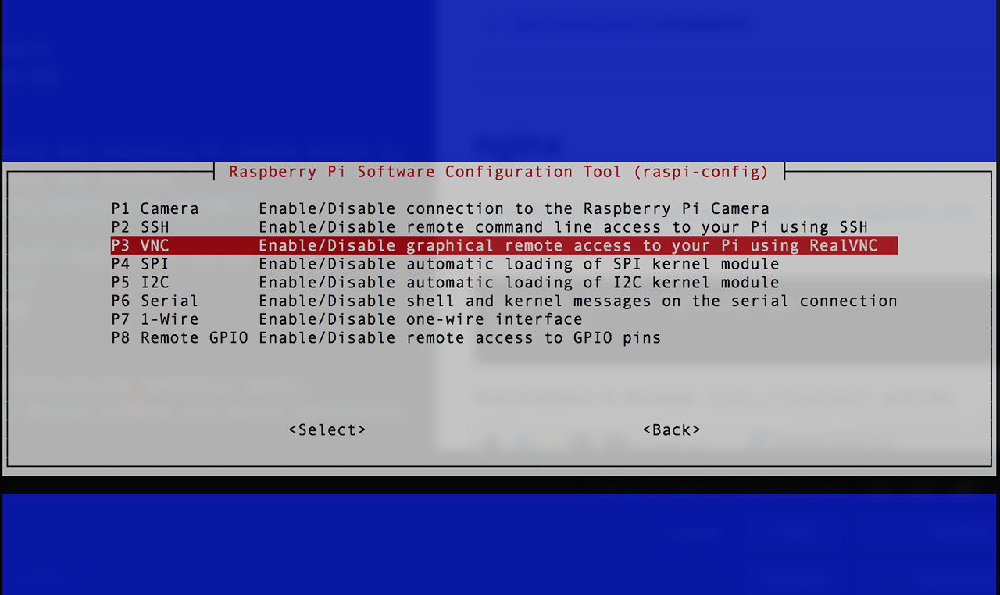

## Betriebssystem installieren
Ich hatte meinen Laptop viele Jahre mit ubuntu betrieben, so dass ich den Raspberry auch gern mit diesem Betriebssystem betrieben möchte. Aktuell (November 2018) ist aber leider noch keine [offizielles Image](https://www.raspberrypi.org/downloads/) für meinen Raspberry Pi 3 B+ verfügbar. Es gibt diverse Beschreibungen und ein inoffizielles [Image](https://pi-buch.info/ubuntu-mate-18-04-fuer-den-raspberry-pi-3b/) für ubuntu mate 18.04; ich war damit aber leider nicht erfolgreich.

Deshalb nutze ich bis auf weiteres [Raspbian Stretch with desktop](https://www.raspberrypi.org/downloads/raspbian). Die Installation geht mit diesem Image sehr einfach und hat darüber hinaus den Vorteil, dass man weder einen Monitor, noch eine Tastatur an den Raspberry anschließen muss.
* Download des [Images](https://downloads.raspberrypi.org/raspbian_latest). Das kleinere **Strech Lite** ohne Desktop wäre auch ausreichend.

* Das Image auf eine SD-Karte flashen.
Hierzu wird [Etcher](https://www.balena.io/etcher/) empfohlen.

* **ssh** für den Remotezugriff aktivieren:
Dazu muss man lediglich mit `touch /Volumes/boot/ssh` eine leere Datei `ssh` auf der boot-Partition auf der sd anlegen. (Je nach genutztem Rechner kann sich der Mount-Point "/Volumes" unterscheiden.)
* **wlan** aktivieren und konfigurieren:
Ein Beschreibung dazu findet sich [hier](https://pi-buch.info/wlan-schon-vor-der-installation-konfigurieren).
Dazu mit `nano /Volumes/boot/wpa_supplicant.conf` eine Datei im root-Verzeichnis der boot-Partition auf der SD-Karte anlegen und folgenden Inhalt eingeben:
```
country=DE
ctrl_interface=DIR=/var/run/wpa_supplicant GROUP=netdev
update_config=1
network={
       ssid="wlan-bezeichnung"
       psk="passwort"
       key_mgmt=WPA-PSK
}
```
Die SD-Karte in den Raspberry einlegen und diesen einschalten. Nach vielleicht einer Minute sollte sich der Raspberry im Netzwerk angemeldet haben und über `ssh pi@<ip-adresse>` erreichbar sein. Das Kennwort für den User pi lautet `raspberry` und natürlich sofort geändert werden.

### Raspi konfigurieren
Mit `sudo raspi-config` die passenden Einstellungen vornehmen:
- Localization: de_DE.UTF-8 UTF-8
- Timezone Europe / Berlin

Ggf. noch die `locale` z.B. auf `de_DE.UTF-8 UTF-8` setzten. Dazu in der Datei `/etc/locale.gen` die entsprechende Zeile entkommentieren.
```
sudo nano /etc/locale.gen
sudo /usr/sbin/locale-gen
```

### Updates
Nun gilt es noch ggf. vorhandene Updates einzuspielen:
Dazu einloggen auf dem Raspberry Pi und mit apt-get aktualisieren.
```
sudo apt-get update
sudo apt-get upgrade
```

### Zeitsynchronisation
Da der Raspberry Pi über keine Echtzeituhr ([Real Time Clock - RTC](https://de.wikipedia.org/wiki/Echtzeituhr)) verfügt, sollte man die Zeit mit einem NTP-Zeitdienst automatisch aktualisieren. Mit dem Kommando `timedatectl status` lässt sich der Status überprüfen.
```
$ timedatectl status
      Local time: Mo 2018-11-12 10:38:32 CET
  Universal time: Mo 2018-11-12 09:38:32 UTC
        RTC time: n/a
       Time zone: Europe/Berlin (CET, +0100)
 Network time on: yes
NTP synchronized: yes
 RTC in local TZ: no
```
Nach meiner Interpretation bedeuten  `Network time on: yes` und `NTP synchronized: yes`, dass dies per Default aktiviert ist.  
Sollte die Zeitzone nicht korrekt sein, diese mit `sudo dpkg-reconfigure tzdata` korrigieren.  

### aliases einrichten
Ich bin gewohnt, dass man `ls -l` durch das Kommando `ll` abkürzen kann.

Hierfür einfach die gewünschten aliases mit dem Kommando `nano .bash_aliases` in die Datei `.bash_aliases` eintragen. Die Syntax für solche Einträge lautet:
```
alias ll='/bin/ls -l'
```

### Remote Desktop
Um auch den Desktop des Raspberry Pi remote öffnen zu können, installiert man einfach [VNC](https://wiki.ubuntuusers.de/VNC/).
```
sudo apt-get install realvnc-vnc-server realvnc-vnc-viewer
sudo raspi-config
```

Zum Menüpunkt **Interfacing Options** gehen;  anschließend zur Option **VNC** und dieses aktivieren.


Den VNC-Viewer für MAC gibt es [hier](https://www.realvnc.com/en/connect/download/viewer).

### Zusätzliche Software-Pakete
#### node
Ein Beschreibung findest sich z.B. [hier](https://www.instructables.com/id/Install-Nodejs-and-Npm-on-Raspberry-Pi/):
```
cd /tmp
wget https://nodejs.org/dist/v10.14.2/node-v10.14.2-linux-armv6l.tar.xz
tar -xf node-v10.14.2-linux-armv6l.tar.xz
cd node-v10.14.2-linux-armv6l/
sudo cp -R * /usr/local/
```
Überprüfen mit `npm -v` und `node -v`.

Nun kann man eine erste minimale Hello World Web-Applikation erstellen:  
```
mkdir ~/Documents/HelloWorld
cd ~/Documents/HelloWorld
nano app.js
```
In die Datei `app.js` folgenden Inhalt eingeben:  
```node
const http = require('http');

const hostname = '127.0.0.1';
const port = 3000;

const server = http.createServer((req, res) => {
  res.statusCode = 200;
  res.setHeader('Content-Type', 'text/plain');
  res.end('Hello World\n');
});

server.listen(port, hostname, () => {
  console.log(`Server running at http://${hostname}:${port}/`);
});

```

Bei Bedarf die kleine Web-App mit `node ~/Documents/HelloWorld/app.js` starten und mit `http://127.0.0.1:3000` prüfen.

---

Als nächstes gilt es, den Raspberry Pi [abzusichern](./security.md).
