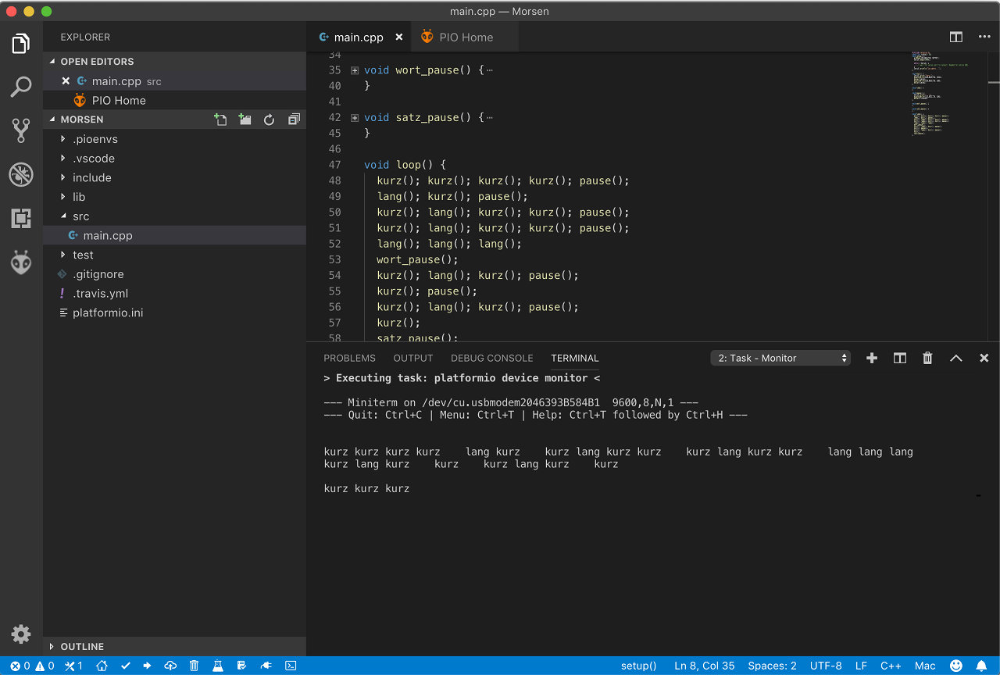

# FireBeetle

Zur späteren Ansteuerung von Sensoren wurde mir der [Firebeetle](https://rover.ebay.com/rover/1/707-53477-19255-0/1?icep_id=114&ipn=icep&toolid=20004&campid=5338436153&mpre=https%3A%2F%2Fwww.ebay.de%2Fitm%2FDFRobot-FireBeetle-ESP8266-IOT-Microcontroller-Supports-Wi-Fi-DF03007%2F273443317964%3Fhash%3Ditem3faa7de8cc%3Ag%3A0OIAAOSwEwNbj5Yq) empfohlen. Um diesen programmieren zu können, lautete die Empfehlung, das Open Source Ecosystem für die IoT-Entwicklung [PlatformIO](https://platformio.org/) zu nutzen.

## PlatformIO
Die [Installationsmedien](https://platformio.org/platformio-ide) von PlatformIO gibt es in einer Variante für den Atom-Editor und einer für Visual Studio Code von Microsoft. Ich bin dem Defaultweg gefolgt und habe die Visual Studio Code installiert.

### Blink-Beispiel
Überraschend einfach konnte ich in Anlehnung an dieses kleine [Tutorial](https://techtutorialsx.com/2017/06/15/firebeetle-esp32-blinking-the-on-board-led/) meine erstes kleines Programm erstellen, dass die kleine blaue LED meinen Namen im Morse-Code blinken lässt.  
- Ein neues Projekt anlegen.
Im Projekt-Wizard einen Namen vergeben und das richtige Board (für meines **FireBeetle-ESP32 (DFRobot)**) anwählen.
- Im File `src/main.cpp` folgenden [Code](../firebeetle/morse_example/main.cpp) eingeben.
- Nun einfach den FireBeetle mit einem USB-Kabel anschließen und das **PlatformIO: Upload**-Ikon drücken.

