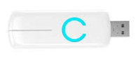

# Hardware
Hier die Liste der benötigten Dinge:
- [Raspberry Pi](#raspberry-pi-3-model-b+)
- [SD-Karte als Speichermedium](#speicher)
- [Stromversorgung](#netzteil)
- [Monitor-Kabel](#hdmi-kabel)
- [Tastatur](#tastatur)
- [aeotec Z-Wave-Stick](#aeotec-z-stick-gen5)

## Raspberry Pi 3 Model B+
Das aktuelle Modell (Nov 2018) hat einen 64-Bit-Quad-Core-Prozessor mit 1.4GHz, 1 GB RAM, Dualband-WLAN mit 2.4GHz und 5GHz, Bluetooth 4.2/BLE und schnelleres Ethernet.

Den Raspberry Pi gibt es für unter 40€ z.B. [hier](https://rover.ebay.com/rover/1/707-53477-19255-0/1?icep_id=114&ipn=icep&toolid=20004&campid=5338436153&mpre=https%3A%2F%2Fwww.ebay.de%2Fitm%2FNeu-Raspberry-Pi-3-Model-B-BCM2837B0-SoC-IoT-PoE-Enabled-RP01048%2F273110053778%3Fepid%3D19018199270%26hash%3Ditem3f96a0b392%3Ag%3A-K4AAOSwIKNb8-u1)\*.

## Speicher
Als permanenter Speicher (Festplatte) für den Raspberry wird zuerst meist eine SD-Karte verwendet. Das Risiko hier ist aber die relativ geringe Haltbarkeit durch die limitierte Überschreibbarkeit, die von den Herstellern mit ca. 10.000 bis 100.000 Schreibzyklen angegeben wird. Die Ursache für den schnellen Ausfall ist das häufige Beschreiben der selben Speicherstellen, da SD-Karten meist kein ausreichendes _[wear leveling](https://www.chip.de/artikel/SSD-So-haelt-die-Hightech-Festplatte-8x-laenger-3_139999723.html)_ aufweisen. In der [Installationsbeschreibung](https://www.openhab.org/docs/installation/rasppi.html) zu OpenHAB wird - allerdings ohne Begründung - empfohlen, daher Karten von mindestens 16 GByte zu nehmen.

Sicher besser und haltbarer ist hier eine SSD-Festplatte, wie z.B. [diese](https://rover.ebay.com/rover/1/707-53477-19255-0/1?icep_id=114&ipn=icep&toolid=20004&campid=5338436153&mpre=https%3A%2F%2Fwww.ebay.de%2Fitm%2FSamsung-860-EVO-PRO-250GB-256GB-500GB-interne-SSD-mSATA-M-2-6-4cm-2-5-SATA3%2F123462925494%3Fhash%3Ditem1cbef6bcb6%3Am%3AmummlD9WCq-X-UKwFKZ3fGQ%3Ark%3A1%3Apf%3A0%26LH_ItemCondition%3D1000%26LH_BIN%3D1)\*. Einen Geschwindigkeitsvorteil konnte ich nicht beobachten; vermutlich weil die SSD über den USB-Port angeschlossen ist.

Unabhängig davon habe ich mich derzeit noch für [diese](https://rover.ebay.com/rover/1/707-53477-19255-0/1?icep_id=114&ipn=icep&toolid=20004&campid=5338436153&mpre=https%3A%2F%2Fwww.ebay.de%2Fitm%2FSANDISK-Ultra-UHS-I-Micro-SDHC-Speicherkarte-32-GB-98-MB-s-Class-10-%2F232765345038)\* SD-Karte von SANDISK (weniger als 10€) entschieden, da hier 10 Jahre [Garantie](https://www.sandisk.de/about/legal/warranty/warranty-table) gegeben werden. Also Rechnung gut aufheben. **Und regelmäßig eine [Sicherung](./backup.md) durchführen!**

In diesem [Artikel](https://buyzero.de/blogs/news/raspberry-pi-sd-karten-korruption-vermeiden-geheimnisse-der-microsd-karte) sind SD-Karten in Raspberry Pis ganz gut beschrieben. Da steht auch, was man machen könnte, um die Lebensdauer der Karten zu erhöhen; ausprobiert habe ich davon noch nichts.

## Netzteil
Der Raspberry ist angeblich recht empfindlich, was die Stromversorgung angeht (sie z.B. [hier](https://www.datenreise.de/raspberry-pi-stromversorgung-netzteil-empfehlung/)). Wenn man nach Netzteilen sucht, finden sich zahlreiche billige Importe; hier hört man jedoch häufig, dass die angegebene Leistung nicht erreicht wird, bzw. dass einem Ladegeräte als Netzteile angeboten werden ([siehe dieser Artikel](https://www.elektronik-kompendium.de/sites/raspberry-pi/2002021.htm)).

Einiges Suchen hat mich zu Netzteilen von [Leicke](https://rover.ebay.com/rover/1/707-53477-19255-0/1?icep_id=114&ipn=icep&toolid=20004&campid=5338436153&mpre=https%3A%2F%2Fwww.ebay.de%2Fsch%2Fi.html%3FLH_PrefLoc%3D1%26_sop%3D15%26_osacat%3D0%26_odkw%3Dleicke%2B5v%2BUSB%26LH_EbayPlus%3D1%26_from%3DR40%26_trksid%3Dm570.l1313%26_nkw%3Dleicke%2B5v%2B%26_sacat%3D0), [Aukru](https://rover.ebay.com/rover/1/707-53477-19255-0/1?icep_id=114&ipn=icep&toolid=20004&campid=5338436153&mpre=https%3A%2F%2Fwww.ebay.de%2Fsch%2Fi.html%3FLH_PrefLoc%3D1%26_sop%3D15%26_osacat%3D0%26_odkw%3DAukru%2B5v%2Braspberry%26LH_EbayPlus%3D1%26_from%3DR40%26_trksid%3Dm570.l1313%26_nkw%3DAukru%2B%2Braspberry%26_sacat%3D0) oder eben zum original [Netzteil](https://rover.ebay.com/rover/1/707-53477-19255-0/1?icep_id=114&ipn=icep&toolid=20004&campid=5338436153&mpre=https%3A%2F%2Fwww.ebay.de%2Fsch%2Fi.html%3F_blrs%3Dspell_check%26_from%3DR40%26_nkw%3Doffizielles%2Braspberry%2Bpi%2Bnetzteil%2B%26_sacat%3D0%26_sop%3D15%26LH_PrefLoc%3D1%26rt%3Dnc%26LH_EbayPlus%3D1) von Raspberry geführt, für das ich mich entschieden habe.

Da ich aber prinzipiell nicht bei Amazon kaufe (warum? Siehe z.B. [Zeit online](https://www.zeit.de/2017/13/amazon-wal-mart-us-wirtschaft-ausbeutung-arbeitnehmer-lohnniveau) oder [PC WELT](https://www.pcwelt.de/a/stop-bezos-politiker-will-amazon-ausbeutung-stoppen,3452252)) und die meisten Angebote z.B. auf ebay eher zweifelhafte Shops zu sein scheinen, hat es etwas gedauert, ehe ich [dieses Angebot](https://rover.ebay.com/rover/1/707-53477-19255-0/1?icep_id=114&ipn=icep&toolid=20004&campid=5338436153&mpre=https%3A%2F%2Fwww.ebay.de%2Fitm%2Foffizielles-Raspberry-Pi-3-Netzteil-microUSB-5-1V-2-5A-schwarz%2F153097906752%3Fhash%3Ditem23a558aa40%3Ag%3Af40AAOSwmLlX2pn5%3Ark%3A2%3Apf%3A0) gefunden habe.

## HDMI-Kabel
Mit einem HDMI-Kabel kann man seinen Fernseher als Bildschirm für den Raspi verwenden. Ich habe hier [dieses](https://rover.ebay.com/rover/1/707-53477-19255-0/1?icep_id=114&ipn=icep&toolid=20004&campid=5338436153&mpre=https%3A%2F%2Fwww.ebay.de%2Fsch%2FVideokabel-stecker%2F32834%2Fi.html%3F_from%3DR40%26_nkw%3DHAMA%2B1%252C5%2Bm%2BHigh%2BSpeed%2BHDMI-Kabel%26_in_kw%3D1%26_ex_kw%3D%26_sacat%3D32834%26_mPrRngCbx%3D1%26_udlo%3D%26_udhi%3D7%26_ftrt%3D901%26_ftrv%3D1%26_sabdlo%3D%26_sabdhi%3D%26_samilow%3D%26_samihi%3D%26_sadis%3D10%26_fpos%3D%26LH_SALE_CURRENCY%3D0%26_sop%3D15%26_dmd%3D1%26_ipg%3D50%26_fosrp%3D1) günstige Kabel für 5 € bei [Mediamarkt](https://www.mediamarkt.de/de/product/_hama-1-5-m-high-speed-1148936.html?uympq=vpqr&rbtc=%7C%7C%7CTV%20%2B%20Audio%20%3E%20Fernseher%20%3E%20Zubeh%C3%B6r%20TV%7Cp%7C%7C&gclid=CjwKCAiAo8jgBRAVEiwAJUXKqDvjs6uAOkE7mwqvfGVKYN-icwWOhv-fx75grmIJaLGQ1jhZVkmf-RoCl80QAvD_BwE&gclsrc=aw.ds) gekauft.

## Tastatur
Für's initiale Einrichten ist eine USB-Tastatur hilfreich. Ich habe dazu eine _alte_ von Dell verwendet.
  
Ansonsten gibt's [hier](https://rover.ebay.com/rover/1/707-53477-19255-0/1?icep_id=114&ipn=icep&toolid=20004&campid=5338436153&mpre=https%3A%2F%2Fwww.ebay.de%2Fsch%2Fi.html%3F_sop%3D15%26LH_ItemCondition%3D1000%26Tastatur%25252FKeypad%3DTastatur%26_oaa%3D1%26Schnittstelle%3DUSB%26_osacat%3D33963%26_odkw%3Dusb%2Btastatur%2B-numerisch%26LH_BIN%3D1%26Tastaturlayout%3DQWERTZ%252520%252528Standard%252529%26_dcat%3D33963%26rt%3Dnc%26Verbindung%3DKabelgebunden%26_from%3DR40%26_trksid%3Dm570.l1313%26_nkw%3Dusb%2Btastatur%2B-numerische%26_sacat%3D33963) günstige Tastaturen.

## aeotec Z-Stick Gen5
 Der Aeon Labs Stick verbindet z.B. einen RPi über die USB-Schnittstelle mit einem Z-Wave-Netz, so dass die SmartHome-Zentrale z-wave-Geräte steuern kann.  

Im November 2018 gab es für unter 50€. Aktuelle Angebote z.B. [hier](https://www.ebay.de/sch/i.html?_from=R40&_nkw=Aeotec++Z-Stick+Gen5&_sacat=0&_sop=15&rt=nc&LH_PrefLoc=2).

---

\* Wenn Du die Sachen nirgendwo günstiger findest, freue ich mich, wenn Du die o.a. Links zum Kauf nutzt. Bin mal gespannt, ob das überhaupt jemand findet und/oder nutzt...

---

|                         |    Preis   |
| ----------------------- | ----------:|
| Raspberry Pi 3 Model B+ |    39,95 € |
| 32 GB SD-Karte          |     9,99 € |
| HDMI-Kabel              |     4,95 € |
| USB-Tastatur            |          - |
| Raspberry Pi 3 Netzteil |    13,84 € |
| aeotec Z-Stick Gen5     |    47,78 € |
| **Summe:**              | **116,51 €** |
