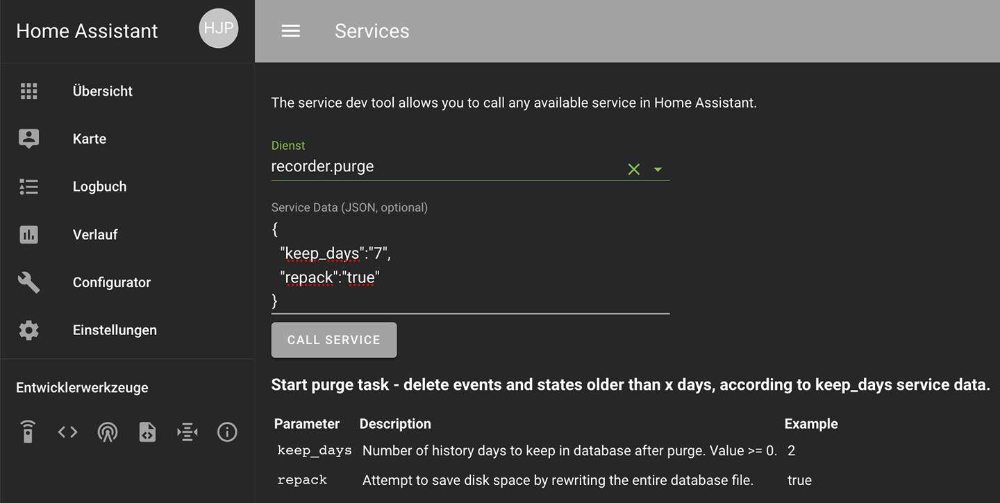

# Home Assistant
## Konfigurationen
### Datenbank-Größe verringern
#### Manuell
Um die Datenbank (/home/homeassistant/.homeassistant/home-assistant_v2.db) manuell zu verkleinern, kann man auf der Seite **Services** den Dienst **recurder.purge** starten. Um. z.B. die Werte der letzten 7 Tage in der Datenbank zu behalten, übergibt man folgende Werte:  
```
{
  "keep_days":"7",
  "repack":"true"
}
```


Das Verkleinern der Datenbank dauert einige Minuten, bzw. wenn es lange nicht durchgeführt wurde, auch Stunden.

#### Regelmäßig automatisiert
Um die Datenbank regelmäßig (täglich) zu bereinigen und z.B. die Daten der letzten 7 Tage zu behalten, muss eine _Automation_ erstellt werden (Siehe [Forum](https://community.home-assistant.io/t/recorder-purge-and-repack/110552)):  
```
# Shrink database
- alias: Purge Database
  initial_state: True
  trigger:
    platform: time
    at: '02:22:22'
  action:
    service: recorder.purge
    data:
      keep_days: 7
      repack: true
```
