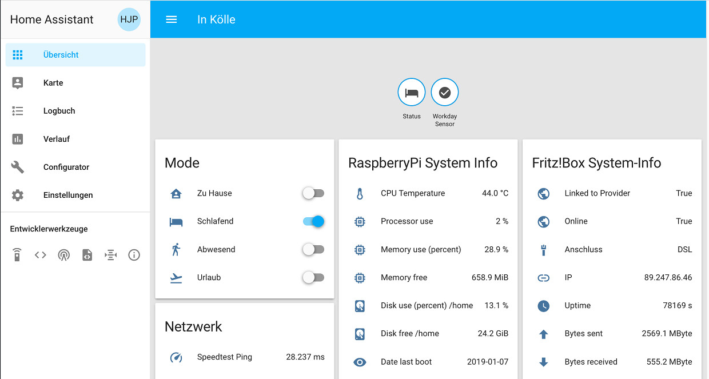
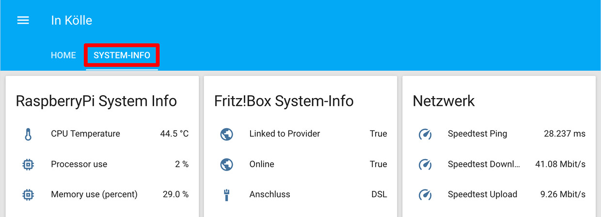

# Konfigurationsdateien aufsplitten
Relativ schnell werden die einzelnen Konfigurationsdateien unübersichtlich groß, so dass es sinnvoll ist, diese gleich aufzuspalten.

## Beispiel: Sensoren
Hierzu wird ein Verzeichnis 'sensors' angelegt, die Datei 'sensors.yaml' in dieses Verzeichnis verschoben (oder in diesem Verzeichnis angelegt) und anschließend wird das ganze Verzeichnis in der Datei 'configuration.yaml' inkludiert.  
'configuration.yaml':
```
...
sensor: !include_dir_merge_list sensors
...
```

# Sensoren gruppieren
Ohne eine entsprechende Einstellung werden alle Sensoren auf der Hauptseite (default_view) als Kreise dargstellt.  

Das erste Mittel zum Ordnen des Chaos' sind **Gruppen**. Einlesen der Datei 'groups.yaml'.  
'configuration.yaml':
```
...
group: !include groups.yaml
...
```
In der Datei 'groups.yaml' erstellt man nun Gruppen und listet die darin enthaltenen Sensoren auf. Hier als Beispiel Sensoren [Systemmonitor Plattform](https://www.home-assistant.io/components/sensor.systemmonitor/):  
'groups.yaml':
```
SystemInfo_group:                        # Group for RaspberryPi System Information
  name: RaspberryPi System Info
  entities:
  - sensor.CPU_Temperature
  - sensor.processor_use
  - sensor.memory_use_percent
  - sensor.memory_free
```


## Tabs
Wenn die Zahl der Sensoren und Gruppen weiter steigt, kann man die Sensoren und/oder die Gruppen in verschiedenen Tabs darstellen. Leider erscheinen diese dann trotzdem noch auf dem Default_view. Dies kann man zwar dadurch verhindern, dass man explizit EInstellungen für diese Tab vornimmt; dies hat jedoch den Nachteil, dass dann neue Sensoren nirgends sichtbar sind, bis diese einem Tab zugeordnet sind. Da sich bei noch viel ändert, habe ich diese Einstellung noch nicht vorgenommen.  
'groups.yaml':
```
#default_view:
#  view: true
#  entities:

SystemInfo_view:
  name: System-Info
  view: true
  entities:
    - group.SystemInfo_group
    - group.FritzBox_group
    - group.Network_group
```

