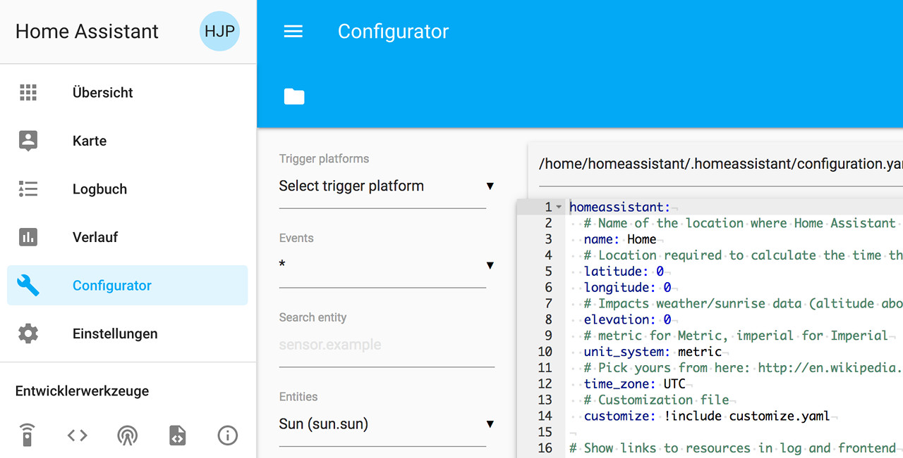

# Home Assistant
## Installation mit docker
Eine Beschreibung zur Installation von HomeAssistant-Docker-Containern findet sich [hier](https://www.home-assistant.io/docs/installation/docker/). Es wird davon ausgegangen, dass docker und docker-compose bereits installiert ist.

### Installation von docker und docker-compose
#### docker
Auf docker.com gibt es ein Skript zur Installation und zum Update von docker. Mit dem nachfolgenden Befehl läd man Skript herunter und installiert docker. Der zweite Befehl ermöglicht, dass der User `Pi` docker ausführen kann.
```
curl -sSL https://get.docker.com | sh
sudo usermod -aG docker pi
```
#### docker-compose
```
sudo pip3 install docker-compose
```

### Installation des HomeAssistant-Containers
**ACHTUNG:** Wenn man auf diese Weise einen Docker-Container herunter lädt und startet, führt dies zu einem Fehler, wenn man einen Container selben Namens mit docker-compose erstellt. Hier müsste dann der bestehende Container mit `docker rename /home-assistant /home-assistant-native-docker` umbenannt werden. Sollte der Container bereits laufen, muss mit `docker update 2aed9c29a1d0 --restart no` der Container auf kein restart gesetzt werden. Mit `docker stop 2aed9c29a1d0` wird der laufende Container gestoppt. Alles in Allem habe ich alles entfernt und erneut mit docker-compose begonnen. 
```
docker run --init -d --name="home-assistant" -v /home/pi/homeassistant:/config -v /etc/localtime:/etc/localtime:ro --net=host homeassistant/raspberrypi3-homeassistant
```

Nach kurzer Zeit ist Home Assistant unter `http://192.168.178.111:8123` erreichbar.  


### docker-compose
Um nach dem booten oder nach einem Fehler HA automatisch neu zu starten, bietet sich der Start über docker-compose an. Dazu wird die Datei `/home/pi/docker-compose.yml` mit folgendem Inhalt angelegt:  
```
  version: '3'
  services:
    homeassistant:
      container_name: home-assistant
      image: homeassistant/home-assistant
      volumes:
        - /home/pi/homeassistant:/config
        - /etc/localtime:/etc/localtime:ro
      restart: always
      network_mode: host
```

Mit `docker-compose up -d` wird nun der Container gestartet, bzw. wenn er noch nicht da ist, herunter geladen.  
Neustart von HomeAssistant erfolgt mit dem Kommando `docker-compose restart`.

---

## Installation - Manuell in Raspbian
<span style="color:red">** Abgelöst durch docker **</span>
[Hier](https://www.home-assistant.io/docs/installation) gibt es Beschreibungen zu verschiedenen Installationsverfahren für **Home Assistant**. Ich habe mich für die [hier](https://www.home-assistant.io/docs/installation/raspberry-pi/) beschriebene manuelle Installation auf einen bereits vorbereiteten Raspberry Pi entschieden.
```
sudo apt-get install python3 python3-venv python3-pip
sudo useradd -rm homeassistant -G dialout,gpio
cd /srv
sudo mkdir homeassistant
sudo chown homeassistant:homeassistant homeassistant

sudo -u homeassistant -H -s
cd /srv/homeassistant
python3 -m venv .
source bin/activate
```

Der erste Aufruf des Systems mit dem Kommando `hass` dauert einige Minuten; nach Abschluss ist Home Assistant über `http://<PI-IP>:8123` erreichbar.


Nachdem man einen User angelegt hat, muss man sich ein erstes mal anmelden:


>**Hinweis:** Bei mir hat der Login nicht funktioniert.
>Erst nachdem ich den hass-Prozess gestoppt und erneut gestartet habe.

### Autostart aktivieren
[Hier](https://www.home-assistant.io/docs/autostart/systemd) gibt es eine Bescheibung, wie man ein Programm beim Systemstart automatisch startet. Mit `sudo nano /etc/systemd/system/home-assistant@homeassistant.service` wird die Datei `home-assistant@homeassistant.service` mit folgendem Inhalt angelegt:

```
[Unit]
Description=Home Assistant
After=network-online.target

[Service]
Type=simple
User=%i
ExecStart=/srv/homeassistant/bin/hass -c "/home/homeassistant/.homeassistant"

[Install]
WantedBy=multi-user.target
```

Reload systemd um die neue Konfiguration bekannt zu machen:

`sudo systemctl --system daemon-reload`

Service enablen, damit dieser nach dem booten gestartet wird:

`sudo systemctl enable home-assistant@homeassistant`

Den Service jetzt **start**en, ohne zu booten. Oder **stop** bzw. **restart**.

`sudo systemctl start home-assistant@homeassistant`

Autostart deaktivieren:

`sudo systemctl disable home-assistant@homeassistant`

### (Optional) Installation von hass.io-Konfigurator
Beim **hass.io-Konfigurator**-Plugin - verfügbar auf [GitHub](https://github.com/danielperna84/hass-configurator) - handelt es sich um einen Web-basierten Editor für die Home Assistant-Konfigurationsdateien mit Syntax-Highlighting. Zur Installation wird die Datei [configurator.py](https://github.com/danielperna84/hass-configurator/blob/master/configurator.py) ins HASS-Homeverzeichnis kopiert, ausführrbar gemacht und ausgeführt.
```
cd /home/homeassistant/.homeassistant
wget https://raw.githubusercontent.com/danielperna84/hass-configurator/master/configurator.py
sudo chown homeassistant configurator.py
sudo chmod a+x configurator.py
```

Mit `sudo nano /home/homeassistant/.homeassistant/configuration.yaml` editieren und Folgendes ergänzen:

```
[...]
http:
  api_password: !secret http.api_password
[...]
# Enable Panel iFrames
panel_iframe:
  configurator:
    title: Configurator
    icon: mdi:wrench
    url: !secret configurator_url
[...]    
```
Hierbei darauf achten, dass das Kennwort in der secrets-Datei ohne **"** eingetragen wird, in der Datei `configurator.py` jedoch mit!  
Nun mit `sudo nano configurator.py` editieren und das Kenntwort eintragen:
```
[...]  
HASS_API_PASSWORD = "<password>"
[...]  
BASEPATH = "/home/homeassistant/.homeassistant/"
[...]  
```

Mit `sudo nano secrets.yaml` das Kennwort und die url zum Aufruf des Konfigurators in folgendem Format eintragen:
```
configurator_url: http://<PI-IP>:3218
http.api_password: <password>
```

Im letzten Schritt wird der Konfigurator gestartet und der Home Assistant restartet.
```
sudo ./configurator.py
sudo systemctl restart home-assistant@homeassistant
```
Anschließend sollte der Konfigurator im Menü des Home Assistant erschienen sein.



#### Autostart des Konfigurators
Analog zu [Autostart aktivieren](#autostart-aktivieren) für den Home Assistant muss im Verzeichnis  `/etc/systemd/system` mit dem Befehl `sudo nano /etc/systemd/system/hass-configurator@homeassistant.service` (Der Dateiname kann beliebig vergeben werden.) eine Datei mit folgendem Inhalt angelegt werden:
```
[Unit]
Description=Home Assistant
After=network-online.target

[Service]
Type=simple
User=%i
ExecStart=/usr/bin/python3  /home/homeassistant/.homeassistant/configurator.py

[Install]
WantedBy=multi-user.target
```

Damit der Service noch aktiviert und beim Booten gestartet wird, müssen noch folgende Kommandos ausgeführt werden:
```
sudo systemctl --system daemon-reload
sudo systemctl start hass-configurator@homeassistant.service
sudo systemctl enable hass-configurator@homeassistant.service
```

### Erste Einstellungen
In der Datei `/home/homeassistant/.homeassistant/configuration.yaml` folgende Einstellungen eingeben:

```
# Name of the location where Home Assistant is running
name: !secret homeassistant.name
latitude: !secret latitude
longitude: !secret longitude
elevation: 53
unit_system: metric
time_zone: Europe/Berlin
```

`/home/homeassistant/.homeassistant/secrets.yaml`:

```
# Use this file to store secrets like usernames and passwords.
# Learn more at https://home-assistant.io/docs/configuration/secrets

# Basic Variables
homeassistant.name: <name>
latitude: <lat>
longitude: <lang>
Fritz_url: http://<FritzBox-IP>
configurator_url: http://<PI-IP>:3218
http.api_password: <password>
```

> Umrechnung der eigenen Adresse in Latitude und Longitude kann man z.B. [hier](https://www.latlong.net/convert-address-to-lat-long.html) machen.

Im nginx Reverse Proxy muss nun noch die Weiterleitung auf die Home Assistant Anwendung konfiguriert werden. Dazu noch die bei der [Installation von nginx](./nginx.md) erstellte Konfigurationsdatei mit `sudo nano /etc/nginx/conf.d/<mydomain>.conf` auf die entsprechenden location-Informationen ändern bzw. erweitern und nginx mit `sudo service nginx restart` neu starten:
```
location / {
    proxy_pass http://localhost:8123;
    proxy_set_header Host $host;
    #proxy_redirect http:// https://;
    proxy_http_version 1.1;
    proxy_set_header Upgrade $http_upgrade;
    proxy_set_header Connection "upgrade";
    proxy_intercept_errors on;
    error_page 404 = @404;
}

location /api/websocket {
    proxy_pass http://localhost:8123/api/websocket;
    proxy_set_header Host $host;
    proxy_http_version 1.1;
    proxy_set_header Upgrade $http_upgrade;
    proxy_set_header Connection "upgrade";
    proxy_intercept_errors on;
    error_page 404 = @404;
}
```
Die jeweils beiden letzten Zeilen leiten auf eine [individuelle Error-Seite](./nginx.md#Custom-Error-Pages) weiter. Dazu muss wie schon für Error 403 noch nachfolgender Eintrag erstellt werden.
```
    error_page 404 = @404;
    location @404 {
        root /var/www/html/;
        try_files /404.html =404;
    }
```

> Fehlt: Reverse Proxy auf für lokalen Zugriff?! Braucht man das bzw. macht das Sinn?

### iOS App
[](https://itunes.apple.com/us/app/home-assistant-open-source-home-automation/id1099568401?mt=8)

Die App erkannte meine Installation automatisch; allerdings unter der lokalen IP-Adresse und nicht unter der _von außen_. Dies korrigiert und dann endlich gefunden, dass im Hintergrund der Login-Screen erschienen ist.  
Nicht sehr intuitiv, aber man bekommt es hin.

Seit kurzen (Feb 2019) gibt es (als beta) eine neue [iOS App](https://community.home-assistant.io/t/hassapp-an-alternative-ios-app-to-empower-your-ha/97713)... Ausprobiert habe ich diese noch nicht.

## Update von Home Assistant
Update gem. dieser [Beschreibung](https://www.home-assistant.io/docs/installation/updating/)

Vor dem Update - und danach - habe ich ein [bootfähiges Update](./backup.md#Erstellen-eines-bootfähigen-Images) erstellt.

Der Update von Version [0.84.6](https://github.com/home-assistant/home-assistant/releases/tag/0.86.4) auf Version [0.87.1](https://github.com/home-assistant/home-assistant/releases/tag/0.87.1) (im Februar 2019) war sehr einfach.   Dito auf 0.90.0 und 0.90.2 - 21.03.2019  
Dito auf 0.90.2 und 0.91.3 - 12.04.2019   
//Dito auf 0.91.1 und 0.92.0 - 07.04.2019.   
```
sudo -u homeassistant -H -s
source /srv/homeassistant/bin/activate
pip3 install --upgrade homeassistant
```
Anschließend noch mit `sudo systemctl restart home-assistant@homeassistant` HA neu starten oder den RasPi rebooten.  
Es bietet sich an, auch gleich noch die letzten [Betriebssystem-Updates einzuspielen](./betriebssystem.md#Updates).

Wie im Kapitel [Backup](./backup.md) beschrieben, erstelle ich nun noch ein weiteres Image und beginne ein neues Restic-Repository.

---

## Update auf python 3.7

wget https://www.python.org/ftp/python/3.7.3/Python-3.7.3.tar.xz
tar xJf Python-3.7.3.tar.xz
cd Python-3.7.3
./configure
   oder
./configure --enable-shared --enable-loadable-sqlite-extensions
make
sudo make install
sudo ldconfig -v
sudo pip3 install --upgrade pip

sudo -u homeassistant -H -s
source /srv/homeassistant/bin/activate
pip3 install --upgrade homeassistant

 1562  sudo systemctl restart home-assistant@homeassistant
 1563  python3
