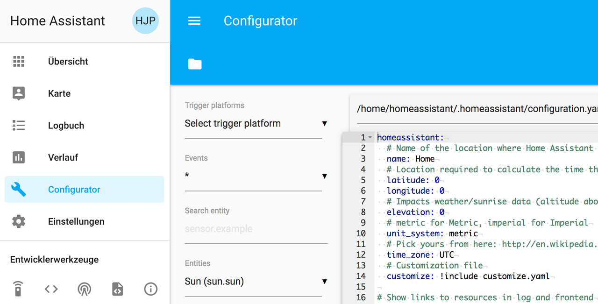

## Home Assistant

[Hier](https://www.home-assistant.io/docs/installation) gibt es Beschreibungen zu verschiedenen Installationsverfahren für **Home Assistant**. Ich habe mich für die [hier](https://www.home-assistant.io/docs/installation/raspberry-pi/) beschriebene manuelle Installation auf einen bereits vorbereiteten Raspberry Pi entschieden.
```
sudo apt-get install python3 python3-venv python3-pip
sudo useradd -rm homeassistant -G dialout,gpio
cd /srv
sudo mkdir homeassistant
sudo chown homeassistant:homeassistant homeassistant

sudo -u homeassistant -H -s
cd /srv/homeassistant
python3 -m venv .
source bin/activate
```

Der erste Aufruf des Systems mit dem Kommando `hass` dauert einige Minuten; nach Abschluss ist Home Assistant über `http://<PI-IP>:8123` erreichbar.


Nachdem man einen User angelegt hat, muss man sich ein erstes mal anmelden:


>**Hinweis:** Bei mir hat der Login nicht funktioniert.
>Erst nachdem ich den hass-Prozess gestoppt und erneut gestartet habe.

### Autostart aktivieren
[Hier](https://www.home-assistant.io/docs/autostart/systemd) gibt es eine Bescheibung, wie man ein Programm beim Systemstart automatisch startet. Mit `sudo nano /etc/systemd/system/home-assistant@homeassistant.service` wird die Datei `home-assistant@homeassistant.service` mit folgendem Inhalt angelegt:

```
[Unit]
Description=Home Assistant
After=network-online.target

[Service]
Type=simple
User=%i
ExecStart=/srv/homeassistant/bin/hass -c "/home/homeassistant/.homeassistant"

[Install]
WantedBy=multi-user.target
```

Reload systemd um die neue Konfiguration bekannt zu machen:

`sudo systemctl --system daemon-reload`

Service enablen, damit dieser nach dem booten gestartet wird:

`sudo systemctl enable home-assistant@homeassistant`

Den Service jetzt **start**en, ohne zu booten. Oder **stop** bzw. **restart**.

`sudo systemctl start home-assistant@homeassistant`

Autostart deaktivieren:

`sudo systemctl disable home-assistant@homeassistant`

### (Optional) Installation von hass.io-Konfigurator
Beim **hass.io-Konfigurator**-Plugin - verfügbar auf [GitHub](https://github.com/danielperna84/hass-configurator) - handelt es sich um einen Web-basierten Editor für die Home Assistant-Konfigurationsdateien mit Syntax-Highlighting. Zur Installation wird die Datei [configurator.py](https://github.com/danielperna84/hass-configurator/blob/master/configurator.py) ins HASS-Homeverzeichnis kopiert, ausführrbar gemacht und ausgeführt.
```
cd /home/homeassistant/.homeassistant
wget https://raw.githubusercontent.com/danielperna84/hass-configurator/master/configurator.py
sudo chown homeassistant configurator.py
sudo chmod a+x configurator.py
```

Mit `sudo nano /home/homeassistant/.homeassistant/configuration.yaml` editieren und Folgendes ergänzen:

```
[...]
http:
  api_password: !secret http.api_password
[...]
# Enable Panel iFrames
panel_iframe:
  configurator:
    title: Configurator
    icon: mdi:wrench
    url: !secret configurator_url
[...]    
```
Nun mit `sudo nano configurator.py` editieren und ein frei gewähltes Kenntwort eintragen:
```
[...]  
HASS_API_PASSWORD = "<password>"
[...]  
BASEPATH = "/home/homeassistant/.homeassistant/"
[...]  
```

Mit `sudo nano secrets.yaml` das Kennwort und die url zum Aufruf des Konfigurators in folgendem Format eintragen:
```
configurator_url: http://<PI-IP>:3218
http.api_password: <password>
```

Im letzten Schritt wird der Konfigurator gestartet und der Home Assistant restartet.
```
sudo ./configurator.py
sudo systemctl restart home-assistant@homeassistant
```
Anschließend sollte der Konfigurator im Menü des Home Assistant erschienen sein.



#### Autostart des Konfigurators
Analog zu [Autostart aktivieren](#autostart-aktivieren) für den Home Assistant muss im Verzeichnis  `/etc/systemd/system` mit dem Befehl `sudo nano /etc/systemd/system/hass-configurator@homeassistant.service` (Der Dateiname kann beliebig vergeben werden.) eine Datei mit folgendem Inhalt angelegt werden:
```
[Unit]
Description=Home Assistant
After=network-online.target

[Service]
Type=simple
User=%i
ExecStart=/usr/bin/python3  /home/homeassistant/.homeassistant/configurator.py

[Install]
WantedBy=multi-user.target
```

Damit der Service noch aktiviert und beim Booten gestartet wird, müssen noch folgende Kommandos ausgeführt werden:
```
sudo systemctl --system daemon-reload
sudo systemctl start hass-configurator@homeassistant.service
sudo systemctl enable hass-configurator@homeassistant.service
```

### Erste Einstellungen
In der Datei `/home/homeassistant/.homeassistant/configuration.yaml` folgende Einstellungen eingeben:

```
# Name of the location where Home Assistant is running
name: !secret homeassistant.name
latitude: !secret latitude
longitude: !secret longitude
elevation: 53
unit_system: metric
time_zone: Europe/Berlin
```

`secrets.yaml`:

```
# Use this file to store secrets like usernames and passwords.
# Learn more at https://home-assistant.io/docs/configuration/secrets

# Basic Variables
homeassistant.name: <name>
latitude: <lat>
longitude: <lang>
Fritz_url: http://<PI-IP>
configurator_url: http://<PI-IP>:3218
http.api_password: <password>
```

Umrechnung der eigenen Adresse in Latitude und Longitude kann man z.B. [hier](https://www.latlong.net/convert-address-to-lat-long.html) machen.
