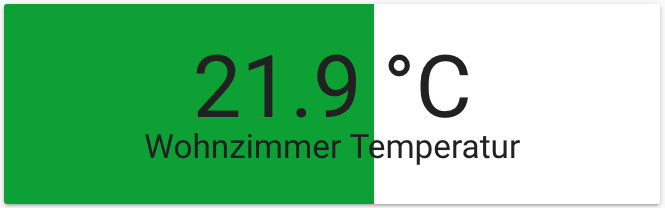

# Lovelace UI:
## Custom Cards
Custom cards herunterladen und in `config` ablegen. config entspricht (bei mir) dem Verzeichnis `/home/homeassistant/.homeassistant/www`. Ich habe darin noch ein Unterverzeichnis `custom_ui` angelegt.

### bignumber-card
  
Den Wert eines Sensor als große Zahl darstellen.  
Den Quellcode gibt es [hier](https://github.com/ciotlosm/custom-lovelace/tree/master/bignumber-card).  
Die Datei `bignumber-card.js` herunterladen und in `config/custom_ui` abspeichern.  
Im lovelace Raw-Editor den Quellcode referenzieren:  
```
resources:
  - type: module
    url: /local/custom_ui/bignumber-card.js
    ```
Nun die Card konfigurieren:
```
cards:
  - type: 'custom:bignumber-card'
    scale: 50px
    from: left
    min: 5
    title: Wohnzimmer Temperatur
    max: 35
    entity: sensor.wohnzimmer_temperatur
    severity:
      - value: 20
        style: var(--label-badge-blue)
      - value: 23
        style: var(--label-badge-green)
      - value: 35
        style: var(--label-badge-blue)
```
