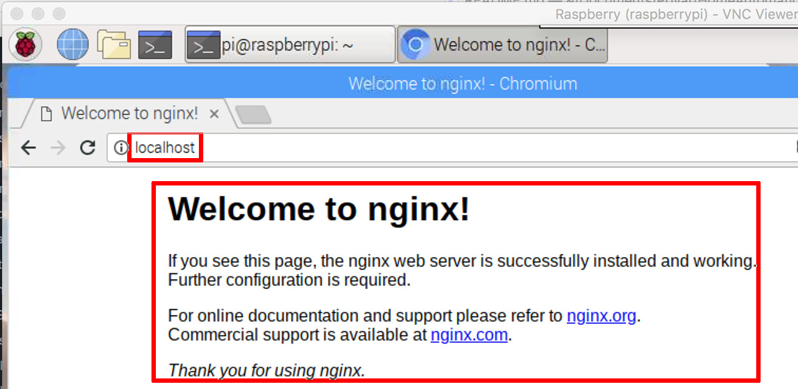

# nginx als reverse Proxy konfigurieren

Prüfen, ob das eigene Netzwerk von *aussen* erreichbar ist ([Vorarbeiten](./fritzbox.md)) und den Raspberry absichern ([Security](security.md)).

## nginx installieren
Der Webserver [nginx](https://de.wikipedia.org/wiki/Nginx) kann u.a. auch als [Reverse-Proxy](https://de.wikipedia.org/wiki/Reverse_Proxy) zur Erhöhung der Sicherheit eingesetzt werden. Eine Beschreibung zur Installation findet sich z.B. [hier](https://howtoraspberrypi.com/install-nginx-raspbian-and-accelerate-your-raspberry-web-server).  
Im November 2018 war im Raspbian-Paketrepository eine ziemlich alte nginx-Version **(v1.10)** verfügbar. Zwischenzeitlich gibt es neue Versionen, die vermeintlich schneller und sicherer seien. Ein wenig weiter [unten](#nginx-auf-aktuellere-version-bringen) habe ich die Installation der aktuellen Version beschreiben.  

### Installation aus dem Raspbian-Paketrepository
```
sudo apt install nginx php-fpm
sudo nginx
```

>**Anmerkung** Ich hatte hier beim ersten Start eine Fehlermeldung:
```
nginx: [emerg] bind() to 0.0.0.0:80 failed (98: Address already in use)
nginx: [emerg] bind() to [::]:80 failed (98: Address already in use)
```
Tat es aber trotzdem... Falls nicht:
`sudo fuser 80/tcp` zeigt die Prozesse, die auf Port 80 zugreifen und `sudo fuser -k 80/tcp` stoppt die Prozesse.

#### Warum php-fpm?
In den Paketrepositories ist nginx nicht an PHP gebunden. Bei der Entwicklung von nginx wurde die Entscheidung getroffen, PHP-FMP (eine schnellere Version von PHP) anstelle eines herkömmlicheren PHP zu verwenden. Daher werden wir php-fpm installieren, um PHP-Dateien mit nginx zu verwalten.

### Aktuellere Version von nginx installieren oder vorhandene nginx Version aktualisieren
Die aktuelle Version **(Dez 2018: v1.14.2-1)** ist nicht ganz so einfach zu installieren, da man hierfür den **testing branch** von **Raspbian** den Paketquellen hinzufügen muss. Eine Beschreibung der Installation habe ich [hier](https://getgrav.org/blog/raspberrypi-nginx-php7-dev) gefunden.

Anlegen der Datei `/etc/apt/sources.list.d/10-buster.list` mit folgendem Inhalt:  
`deb http://mirrordirector.raspbian.org/raspbian/ buster main contrib non-free rpi`

Anlegen der Datei `/etc/apt/preferences.d/10-buster` mit folgendem Inhalt:  
```
Package: *
Pin: release n=stretch
Pin-Priority: 900

Package: *
Pin: release n=buster
Pin-Priority: 750
```

Die Installation erfolgt mit den nachstehenden Kommandos. Hierbei habe ich alle Default-Werte akzeptiert.  
```shell
sudo apt-get update
sudo apt-get install -t buster nginx
```

Bei mir ist Installation nicht _glatt_ durchgelaufen; zwei der Meldungen habe ich mir zur Sicherheit [hier](./nginx_update_errors.md) aufgehoben.


### nginx starten beim booten
>**Anmerkung:** War bei mir auch ohne dies Kommando bereits autostart.

Ausführen des Kommandos:  
`sudo update-rc.d -f nginx defaults`

### nginx-Funktionaltät prüfen
Auf dem Pi im Browser `http://localhost` oder auf dem Client `http://192.168.178.111` aufrufen, um die Funktion zu überprüfen:  


### NGINX als ReverseProxy konfigurieren
([Hier](https://www.smarthomeng.de/nginx-als-reverseproxy) und [hier](https://www.home-assistant.io/docs/ecosystem/certificates/lets_encrypt) gibt es eine sehr ausführliche Beschreibung, wie man sein Home Automation durch einen Reverse Proxy mit SSL-Zertifikat (siehe [hier](https://goneuland.de/debian-9-stretch-lets-encrypt-zertifikate-mit-certbot-erstellen/)) absichern kann.  
Leider habe ich das bisher nicht hinbekommen.)

<!---
Die im Repo vorhandene Version ist recht alt (Nov 18: v0.10.2).
Daher nutze ich das Installationsskript. Darauf achten, dass Port 80 vorübergehend auf den Raspberry weitergeleitet wird (siehe [Portfreigabe](./remote.md#portfreigabe-in-fritzbox-einrichten)).
-->

#### Erstellen eines Zertifikates mit LetsEncrypt:
##### Vorbereitende Einstellungen
Vor der Erstellung des Zertifikates sind noch einige Einstellungen zu machen.

Damit `certbot:` die Identität überprüfen kann:

Mit `sudo nano /etc/nginx/snippets/letsencrypt.conf` eine Datei anlegen und folgenden Inhalt eingeben.
```
location ^~ /.well-known/acme-challenge/ {
 default_type "text/plain";
 root /var/www/letsencrypt;
}
```
Anschließend folgende Kommandos ausführen:
```
sudo mkdir -p /var/www/letsencrypt/.well-known/acme-challenge
sudo nano /etc/nginx/sites-available/default
```
Nun unterhalb von `listen [::]:80 default_server;` die Zeile `include /etc/nginx/snippets/letsencrypt.conf;` einfügen, so dass die eben erstellte Datei inkludiert wird.
```
server {
        listen 80 default_server;
        listen [::]:80 default_server;
        include /etc/nginx/snippets/letsencrypt.conf;
[...]
```
Mit `sudo service nginx restart` nginx neu starten.

##### Zertifikat erzeugen
```
cd
mkdir certbot
cd certbot/
wget https://dl.eff.org/certbot-auto
chmod u+x certbot-auto
sudo ./certbot/certbot-auto certonly --rsa-key-size 4096 --webroot -w /var/www/letsencrypt --email <myMail> -d <myDNSName>
```

Beim ersten Aufruf wird die benötigte Software installiert, bei späteren Aufrufen ggf. aktualisiert (0.29.1) und anschließend das Zertifikat herunter geladen.
Damit der LetsEncrypt-Server die angegebene Domain überprüfen kann, muss **kurzfristig** Port 80 freigegeben werden. Ist dies nicht der Fall, erhält man eine Fehlermeldung: `The server could not connect to the client to verify the domain`.

Mit dem Kommando `sudo ls -l /etc/letsencrypt/live` kann man überprüfen, dass ein Ordner mit dem Namen der eigenen dynDNS angelegt wurde.

Nun noch mit `sudo nano /etc/nginx/conf.d/<mydomain>.conf` die Konfigurationsdatei für die eigene Domäne erstellen. Hier der erste minimale Inhalt dieser Datei in Anlehnung an das oben erwähnte [Tutorial](https://www.smarthomeng.de/nginx-als-reverseproxy).

```
server {
    listen 443 ssl default_server;
    server_name <myDNSName>;

    ##
    # SSL
    ##
    ## Activate SSL, setze SERVER Zertifikat Informationen ##
    # Generiert via Let's Encrypt!
    ssl on;
    ssl_certificate /etc/letsencrypt/live/<myDNSName>/fullchain.pem;
    ssl_certificate_key /etc/letsencrypt/live/<myDNSName>/privkey.pem;
    ssl_session_cache builtin:1000 shared:SSL:10m;
    ssl_prefer_server_ciphers on;
    # unsichere SSL Ciphers deaktivieren!
    ssl_ciphers    HIGH:!aNULL:!eNULL:!LOW:!3DES:!MD5:!RC4;

    ##
    # HSTS
    ##
    add_header Strict-Transport-Security "max-age=31536000; includeSubDomains" always;

    ##
    # global
    ##
    root /var/www/<myDNSName>;
    index index.php index.htm index.html;

    # Weiterleitung von allen über https eingehenden Calls auf einen nodejs-Testserver
    location / {
        proxy_pass      http://127.0.0.1:3000;
        proxy_buffering off;
    }
}
```

Mit `sudo service nginx restart` nginx neu starten.


##### Zertifikat erneuern
Mit `sudo ./certbot/certbot-auto renew --dry-run` kann man testen, ob die automatische Erneuerung des Zertifikates funktionieren würde.  
Es fehlt noch, diese Erneuerung alle 2 Monate zu automatisieren


##### sshguard?
Wird das überhaupt benötigt, wenn man sich ohnehin nicht mit Kennwort anmelden kann?  
https://www.pilgermaske.org/2018/06/sshguard-schnell-und-einfach-ssh-absichern/

## GeoIP installieren und konfigurieren
Über GeoIP kann herausgefunden werden, aus welchem Land eine Anfrage kommt, so dass man bestimmte Länder zulassen oder blockieren kann.
```
sudo apt-get install geoip-database libgeoip1
cd /usr/share/GeoIP/
sudo wget http://geolite.maxmind.com/download/geoip/database/GeoLiteCountry/GeoIP.dat.gz
sudo gunzip GeoIP.dat.gz
```
Nun die Datei `/etc/nginx/nginx.conf` bearbeiten und direkt im „http“ Block die GeoIP Einstellungen hinzufügen:
```
    # GeoIP Settings
    # Nur Länder aus erlaubten IP Bereichen dürfen den ReverseProxy
    # passieren!
    # https://www.howtoforge.de/anleitung/nginx-besucher-mit-dem-geoip-modul-nach-landern-blocken-debianubuntu/
    ##
    geoip_country /usr/share/GeoIP/GeoIP.dat;
    map $geoip_country_code $allowed_country {
        default no;
        DE yes;
    }
```
>*Achtung:* Man kommt dann auch selbst nicht durch, wenn man sich im Ausland befindet.

Nun mit `sudo nano /etc/nginx/conf.d/<mydomain>.conf` die Konfigurationsdatei im Server-Block erweitern:
```
server {
    [...]
    ## Blocken, wenn Zugriff aus einem nicht erlaubten Land erfolgt ##
    if ($allowed_country = no) {
        return 403;
    }
    [...]
}
```
Nach dem Neustart von NGINX mit `sudo service nginx restart` ist die Änderung aktiv.

## Custom Error Pages
Um eine angepasste Seite bei Errors anzeigen zu können, muss eine entsprechende Seite erstellt und die <mydomain>.conf-Datei in der Server-Section angepasst werden.  
<mydomain>.conf:  
```
    if ($allowed_country = no) {
       return 403;
    }
    error_page 403 = @403;
    location @403 {
        root /var/www/html/;
        try_files /403.html =403;
    }
```
403.html:  
```html
<!DOCTYPE html>
<html lang="en">
<head>
    <!-- Simple HttpErrorPages | MIT License | https://github.com/AndiDittrich/HttpErrorPages -->
    <meta charset="utf-8" /><meta http-equiv="X-UA-Compatible" content="IE=edge" /><meta name="viewport" content="width=device-$
    <title>Access Denied</title>
    <style type="text/css">
    html{font-family:sans-serif;line-height:1.15;-ms-text-size-adjust:100%;-webkit-text-size-adjust:100%}body{margin:0}article,$
</head>
<body>
    <div class="cover"><h1>Access Denied</h1><p class="lead"><small>Error 403</small></p></div>
</body>
</html>
```

## Weitere Maßnahmen zur Sicherung
[Hier](https://www.cyberciti.biz/tips/linux-unix-bsd-nginx-webserver-security.html) kann man einige Einstellungen zur Abwehr von bots, spammern und ähnlichem nachlesen. Es gilt die nginx-Konfigurationsdatei mit `sudo nano /etc/nginx/conf.d/<mydomain>.conf` im Server-Block zu erweitern:
```
if ($http_user_agent ~* LWP::Simple|BBBike|wget) {
    return 403;
}
if ($http_user_agent ~* msnbot|scrapbot) {
    return 403;
}
if ( $http_referer ~* (babes|forsale|girl|jewelry|love|nudit|organic|poker|porn|sex|teen) ) {
    return 403;
}
```


# AB HIER BEKOMME ICH ES NICHT ANS LAUFEN


Eine gute Bescheibung zu Zertifikaten gibt es [hier](https://tech.europace.de/client-authentifizierung-per-tls/).


## Client Zertifikat
LinkSammlung:
Von Jörg: https://github.com/node-opcua/node-opcua/blob/master/documentation/notes_on_certificates.md
https://deliciousbrains.com/ssl-certificate-authority-for-local-https-development/
https://www.hagen-bauer.de/2014/06/eigene-ca-erstellen.html
https://blog.netways.de/2018/08/15/realisierung-einer-clientbasierter-zertifikats-authentifizierung-mutual-ssl-mit-selbstsignierten-zertifikaten-auf-linux-apache/


Für die Sicherung des Raspberry Pi durch Client-Zertifikate gibt es [hier](https://blog.netways.de/2018/08/15/realisierung-einer-clientbasierter-zertifikats-authentifizierung-mutual-ssl-mit-selbstsignierten-zertifikaten-auf-linux-apache/), [hier](https://www.smarthomeng.de/nginx-als-reverseproxy) und [hier](https://medium.com/@pavelevstigneev/setting-nginx-with-letsencrypt-and-client-ssl-certificates-3ae608bb0e66) hilfreiche Anleitungen.

>**Anmerkung:** *pi* in den Dateinamen (z.B. *pi.key*) ist beliebig gewählt.

Erstellung eines eigenen rootca-Zertifikates-Privatekeys mit 4096 bit Schlüssellänge und Encryption des erstellten privaten Keys mit einem Kennwort:

`sudo openssl genrsa -des3 -out /etc/ssl/ca/private/rootca.key 4096`

Erstellen eines Serverzertifikats mit 3 Jahren Gültigkeit:

`sudo openssl req -new -x509 -days 1095 -key /etc/ssl/ca/private/rootca.key -out /etc/ssl/ca/certs/rootca.crt`

Erstellen eines Keys für einen ersten Client. - Hier 4096 oder nur 1024

`sudo openssl genrsa -des3 -out /etc/ssl/ca/certs/users/mac.key 1024`

Für den soeben erstellten Client-Key erstellen wir nun eine Zertifikatsanforderung (CSR):

`sudo openssl req -new -key /etc/ssl/ca/certs/users/mac.key -out /etc/ssl/ca/certs/users/mac.csr`

Jetzt signieren wir die Zertifikatsanforderung (CSR) des Clients gegen unser Serverzertifikat und erstellen ein Client-Zertifikat:

`sudo openssl x509 -req -days 1095 -in /etc/ssl/ca/certs/users/mac.csr -CA /etc/ssl/ca/certs/rootca.crt -CAkey /etc/ssl/ca/private/rootca.key -CAserial /etc/ssl/ca/serial -CAcreateserial -out /etc/ssl/ca/certs/users/mac.crt`

Abschließend exportieren wir das Clientzertifikat und den Key übertragungstauglich in PKCS12-Format:
```
sudo openssl pkcs12 -export -clcerts -in /etc/ssl/ca/certs/users/mac.crt -inkey /etc/ssl/ca/certs/users/mac.key -out /etc/ssl/ca/certs/users/mac.p12

sudo cp /etc/ssl/ca/certs/users/mac.p12 /home/pi
cd /home/pi/
sudo chown pi mac.p12
```

---

---


https://medium.com/@pavelevstigneev/setting-nginx-with-letsencrypt-and-client-ssl-certificates-3ae608bb0e66
https://knowledge.digicert.com/solution/SO25984.html


Erstellung eines eigenen rootca-Zertifikates-Privatekeys mit 4096 bit Schlüssellänge und Encryption des erstellten privaten Keys mit einem Kennwort:

`sudo openssl genrsa -des3 -out /etc/ssl/ca/private/rootca.key 4096`

Erstellen eines Serverzertifikats mit 3 Jahren Gültigkeit:

`sudo openssl req -new -x509 -days 1095 -key /etc/ssl/ca/private/rootca.key -out /etc/ssl/ca/certs/rootca.crt`

Erstellen eines Keys für einen ersten Client. - Hier 4096 oder nur 1024
`sudo openssl genrsa -out /etc/ssl/ca/client.key 4096`

Für den soeben erstellten Client-Key erstellen wir nun eine Zertifikatsanforderung (CSR):

`sudo openssl req -new -key /etc/ssl/ca/client.key -out /etc/ssl/ca/client.csr`

Jetzt signieren wir die Zertifikatsanforderung (CSR) des Clients gegen unser Serverzertifikat und erstellen ein Client-Zertifikat:

`sudo openssl x509 -req -days 1095 -in /etc/ssl/ca/client.csr -CA /etc/ssl/ca/certs/rootca.crt -CAkey /etc/ssl/ca/private/rootca.key -CAserial /etc/ssl/ca/serial -CAcreateserial -out /etc/ssl/ca/client.crt`

#`sudo openssl req -new -x509 -days 365 -key /etc/ssl/ca/client.key -out /etc/ssl/ca/client.crt`

Abschließend exportieren wir das Clientzertifikat und den Key übertragungstauglich in PKCS12-Format:
 `sudo openssl pkcs12 -export -clcerts -in /etc/ssl/ca/client.crt -inkey /etc/ssl/ca/client.key -out /etc/ssl/ca/client.p12`


Das Zertifkat konnte ich nur akzeptieren, wenn ich auf node.js weitergeleitet habe. Nicht bei homeAssistant


---

sudo openssl genrsa -des3 -out /etc/ssl/ca/private/rootca.key 4096
sudo openssl req -new -x509 -days 1095 -key /etc/ssl/ca/private/rootca.key -out /etc/ssl/ca/certs/rootca.crt

sudo openssl ca -name CA_default -gencrl -keyfile /etc/ssl/ca/private/rootca.key -cert /etc/ssl/ca/certs/rootca.crt -out /etc/ssl/ca/private/rootca.crl -crldays 1095

sudo openssl genrsa -out /etc/ssl/ca/client.key 4096


sudo openssl req -new -key /etc/ssl/ca/client.key -out /etc/ssl/ca/client.csr
sudo openssl x509 -req -days 1095 -in /etc/ssl/ca/client.csr -CA /etc/ssl/ca/certs/rootca.crt -CAkey /etc/ssl/ca/private/rootca.key -CAserial /etc/ssl/ca/serial -CAcreateserial -out /etc/ssl/ca/client.crt

sudo openssl req -new -x509 -days 365 -key /etc/ssl/ca/client.key -out /etc/ssl/ca/client.crt
sudo openssl pkcs12 -export -clcerts -in /etc/ssl/ca/client.crt -inkey /etc/ssl/ca/client.key -out /etc/ssl/ca/client.p12


# von rene
ipsec pki --gen --type rsa --size 4096 --outform der > private/strongswanKey.der
ipsec pki --self --in strongswanKey.der --dn "C=CH, O=strongSwan, CN=hajo" --ca > certs/strongswanCert.der


#!/bin/bash
NAME="Hajo Pross"
USERNAME="hajo"
USERID="hajo"
COUNTRY_CODE=DE
ORGANISATION="Hajo SmartHome"


ipsec pki --gen --type rsa --size 4096 --outform der > private/$USERNAME.der

ipsec pki --pub --in private/$USERNAME.der --type rsa | ipsec pki --issue --lifetime 730 --cacert certs/strongswanCert.der --cakey private/strongswanKey.der --dn "C=$COUNTRY_CODE, O=$ORGANISATION, CN=$USERID" --san "$USERID" --outform der > certs/$USERNAME.der

openssl rsa -inform DER -in private/$USERNAME.der -out private/$USERNAME.pem -outform PEM

openssl x509 -inform DER -in certs/$USERNAME.der -out certs/$USERNAME.pem -outform PEM

openssl pkcs12 -export -inkey private/$USERNAME.pem -in certs/$USERNAME.pem -name "$NAME's VPN Certificate" -certfile cacerts/strongswan.pem -caname "$ORGANISATION Root CA" -out p12/$USERNAME.p12


ipsec pki --gen --type rsa --size 2048 --outform der > $USERNAME.der
ipsec pki --pub --in $USERNAME.der --type rsa | ipsec pki --issue --lifetime 730 --certs strongswanCert.der --cakey strongswanKey.der --dn "C=$COUNTRY_CODE, O=$ORGANISATION, CN=$USERID" --san "$USERID" --outform der > $USERNAME_Cert.der
openssl rsa -inform DER -in $USERNAME.der -out $USERNAME.pem -outform PEM
openssl x509 -inform DER -in $USERNAME.der -out $USERNAME.pem -outform PEM
openssl pkcs12 -export -inkey $USERNAME.pem -in $USERNAME.pem -name "$NAME's VPN Certificate" -certfile strongswan.pem -caname "$ORGANISATION Root CA" -out $USERNAME.p12


http://www.inanzzz.com/index.php/post/lsto/using-x-509-client-certificate-authentication-with-php-fpm-and-nginx

https://blog.netways.de/2018/08/15/realisierung-einer-clientbasierter-zertifikats-authentifizierung-mutual-ssl-mit-selbstsignierten-zertifikaten-auf-linux-apache/


ipsec
 1260  ipsec pki --gen --type rsa --size 4096 --outform der > strongswanKey.der
 1263  ipsec pki --gen --type rsa --size 4096 --outform der > strongswanKey.der
 1265  ipsec pki --self --ca --lifetime 3650 --in strongswanKey.der --type rsa --cn “Hajo"” --outform der > strongswanCert.der
 1266  ipsec pki --self --ca --lifetime 3650 --in strongswanKey.der --type rsa --dn “CN=Hajo” --outform der > strongswanCert.der
 1268  ipsec pki --self --in strongswanKey.der --dn “C=CH, O=strongSwan, CN=hajo” --ca > strongswanCert.der
 1269  ipsec pki --self --in strongswanKey.der --dn "C=CH, O=strongSwan, CN=hajo" --ca > strongswanCert.der
 1275  ipsec pki --gen --type rsa --size 2048 --outform der > $USERNAME.der
 1277  ipsec pki --gen --type rsa --size 2048 --outform der > hajoNAME="Hajo Pross".der
 1288  ipsec pki --gen --type rsa --size 2048 --outform der > $USERNAME.der
 1293  ipsec pki --gen --type rsa --size 2048 --outform der > $USERNAME.der
 1296  ipsec pki --pub --in $USERNAME.der --type rsa | ipsec pki --issue --lifetime 730 --cacert strongswanCert.der --cakey strongswanKey.der --dn "C=$COUNTRY_CODE, O=$ORGANISATION, CN=$USERID" --san "$USERID" --outform der > $USERNAME.der
 1299  ipsec pki --gen --type rsa --size 2048 --outform der > $USERNAME.der
 1300  ipsec pki --pub --in $USERNAME.der --type rsa | ipsec pki --issue --lifetime 730 --cacert strongswanCert.der --cakey strongswanKey.der --dn "C=$COUNTRY_CODE, O=$ORGANISATION, CN=$USERID" --san "$USERID" --outform der > $(USERNAME)Cert.der
 1302  ipsec pki --pub --in $USERNAME.der --type rsa | ipsec pki --issue --lifetime 730 --cacert strongswanCert.der --cakey strongswanKey.der --dn "C=$COUNTRY_CODE, O=$ORGANISATION, CN=$USERID" --san "$USERID" --outform der > $USERNAMECert.der
 1316  ipsec pki --gen --type rsa --size 2048 --outform der > private/$USERNAME.der
 1319  ipsec pki --pub --in private/$USERNAME.der --type rsa | ipsec pki --issue --lifetime 730 --cacert cacerts/strongswan.der --cakey private/strongswan.der --dn "C=$COUNTRY_CODE, O=$ORGANISATION, CN=$USERID" --san "$USERID" --outform der > certs/$USERNAME.der


ipsec pki --gen --type rsa --size 4096 --outform der > strongswanKey.der
ipsec pki --self --in strongswanKey.der --dn "C=CH, O=strongSwan, CN=hajo" --ca > strongswanCert.der
ipsec pki --gen --type rsa --size 2048 --outform der > $USERNAME.der
ipsec pki --pub --in private/$USERNAME.der --type rsa | ipsec pki --issue --lifetime 730 --cacert strongswanCert.der --cakey strongswanKey.der --dn "C=$COUNTRY_CODE, O=$ORGANISATION, CN=$USERID" --san "$USERID" --outform der > certs/$USERNAME.der
openssl rsa -inform DER -in private/$USERNAME.der -out private/$USERNAME.pem -outform PEM
openssl x509 -inform DER -in certs/$USERNAME.der -out certs/$USERNAME.pem -outform PEM
openssl pkcs12 -export -inkey private/$USERNAME.pem -in certs/$USERNAME.pem -name "$NAME's VPN Certificate" -certfile strongswanCert.der -caname "$ORGANISATION Root CA" -out p12/$USERNAME.p12


ipsec pki --gen --type rsa --size 4096 --outform der > strongswanKey.der
ipsec pki --self --in strongswanKey.der --dn "C=CH, O=strongSwan, CN=hajo" --ca > strongswanCert.der


ipsec pki --gen --type rsa --size 2048 --outform der > $USERNAME.der
ipsec pki --pub --in $USERNAME.der --type rsa | ipsec pki --issue --lifetime 730 --cacert strongswanCert.der --cakey strongswanKey.der --dn "C=$COUNTRY_CODE, O=$ORGANISATION, CN=$USERID" --san "$USERID" --outform der > certs/$USERNAME.der
openssl rsa -inform DER -in private/$USERNAME.der -out private/$USERNAME.pem -outform PEM
openssl x509 -inform DER -in certs/$USERNAME.der -out certs/$USERNAME.pem -outform PEM
openssl pkcs12 -export -inkey private/$USERNAME.pem -in certs/$USERNAME.pem -name "$NAME's VPN Certificate" -certfile cacerts/strongswan.pem -caname "$ORGANISATION Root CA" -out p12/$USERNAME.p12


1335 openssl x509 -in strongswan.der -out strongswan.pem -outform PEM
 1336  openssl x509 -in strongswan.der -inform DER -out strongswan.pem -outform PEM
 1339  openssl pkcs12 -export -inkey private/$USERNAME.pem -in certs/$USERNAME.pem -name "$NAME's VPN Certificate" -certfile cacerts/strongswan.pem -caname "$ORGANISATION Root CA" -out p12/$USERNAME.p12


 ---

 03.12.

 1258  strongswan pki --gen --type rsa --size 4096 --outform der > strongswanKey.der
 1259  ipsec
 1260  ipsec pki --gen --type rsa --size 4096 --outform der > strongswanKey.der
 1261  pki
 1262  sudo apt-get install strongswan-pki
 1263  ipsec pki --gen --type rsa --size 4096 --outform der > strongswanKey.der
 1264  ll
 1265  ipsec pki --self --ca --lifetime 3650 --in strongswanKey.der --type rsa --cn “Hajo"” --outform der > strongswanCert.der
 1266  ipsec pki --self --ca --lifetime 3650 --in strongswanKey.der --type rsa --dn “CN=Hajo” --outform der > strongswanCert.der
 1267  ll
 1268  ipsec pki --self --in strongswanKey.der --dn “C=CH, O=strongSwan, CN=hajo” --ca > strongswanCert.der
 1269  ipsec pki --self --in strongswanKey.der --dn "C=CH, O=strongSwan, CN=hajo" --ca > strongswanCert.der
 1270  ll
 1271  mv strongswanKey.der strongswan.der
 1272  mv strongswan.der strongswanKey.der
 1273  ll
 1274  clear
 1275  ipsec pki --gen --type rsa --size 2048 --outform der > $USERNAME.der
 1276  ll
 1277  ipsec pki --gen --type rsa --size 2048 --outform der > hajoNAME="Hajo Pross".der
 1278  USERNAME="hajo"
 1279  USERID="hajo"
 1280  COUNTRY_CODE=DE
 1281  NAME="Hajo Pross"
 1282  USERNAME="hajo"
 1283  USERID="hajo"
 1284  COUNTRY_CODE=DE
 1285  ORGANISATION="hajo CA"
 1286  echo $USERNAME
 1287  clear
 1288  ipsec pki --gen --type rsa --size 2048 --outform der > $USERNAME.der
 1289  ll
 1290  rm hajoNAME=Hajo Pross.der
 1291  rm "hajoNAME=Hajo Pross.der"
 1292  ll
 1293  ipsec pki --gen --type rsa --size 2048 --outform der > $USERNAME.der
 1294  ll
 1295  cat hajo.der
 1296  ipsec pki --pub --in $USERNAME.der --type rsa | ipsec pki --issue --lifetime 730 --cacert strongswanCert.der --cakey strongswanKey.der --dn "C=$COUNTRY_CODE, O=$ORGANISATION, CN=$USERID" --san "$USERID" --outform der > $USERNAME.der
 1297  ll
 1298  cat hajo.der
 1299  ipsec pki --gen --type rsa --size 2048 --outform der > $USERNAME.der
 1300  ipsec pki --pub --in $USERNAME.der --type rsa | ipsec pki --issue --lifetime 730 --cacert strongswanCert.der --cakey strongswanKey.der --dn "C=$COUNTRY_CODE, O=$ORGANISATION, CN=$USERID" --san "$USERID" --outform der > $(USERNAME)Cert.der
 1301  ll
 1302  ipsec pki --pub --in $USERNAME.der --type rsa | ipsec pki --issue --lifetime 730 --cacert strongswanCert.der --cakey strongswanKey.der --dn "C=$COUNTRY_CODE, O=$ORGANISATION, CN=$USERID" --san "$USERID" --outform der > $USERNAMECert.der
 1303  ll
 1304  mv Cert.der hajoCert.der
 1305  ll
 1306  rm hajo*
 1307  mkdir private
 1308  mkdir cacerts
 1309  mkdir p12
 1310  mkdir certs
 1311  ll
 1312  mv strongswanCert.der cacerts/strongswan.der
 1313  mv strongswanKey.der private/strongswan.der
 1314  ll
 1315  ll -R
 1316  ipsec pki --gen --type rsa --size 2048 --outform der > private/$USERNAME.der
 1317  clear
 1318  ll -R
 1319  ipsec pki --pub --in private/$USERNAME.der --type rsa | ipsec pki --issue --lifetime 730 --cacert cacerts/strongswan.der --cakey private/strongswan.der --dn "C=$COUNTRY_CODE, O=$ORGANISATION, CN=$USERID" --san "$USERID" --outform der > certs/$USERNAME.der
 1320  clear; ll -R
 1321  openssl rsa -inform DER -in private/$USERNAME.der -out private/$USERNAME.pem -outform PEM
 1322  clear; ll -R
 1323  openssl x509 -inform DER -in certs/$USERNAME.der -out certs/$USERNAME.pem -outform PEM
 1324  clear; ll -R
 1325  openssl pkcs12 -export -inkey private/$USERNAME.pem -in certs/$USERNAME.pem -name "$NAME's VPN Certificate" -certfile cacerts/strongswan.pem -caname "$ORGANISATION Root CA" -out p12/$USERNAME.p12
 1326  pwd
 1327  ll
 1328  cd certs/
 1329  ll
 1330  cd ..
 1331  cd cacerts/
 1332  ll
 1333  history
 1334  history | grep pem
 1335  openssl x509 -in strongswan.der -out strongswan.pem -outform PEM
 1336  openssl x509 -in strongswan.der -inform DER -out strongswan.pem -outform PEM
 1337  ll
 1338  cd ..
 1339  openssl pkcs12 -export -inkey private/$USERNAME.pem -in certs/$USERNAME.pem -name "$NAME's VPN Certificate" -certfile cacerts/strongswan.pem -caname "$ORGANISATION Root CA" -out p12/$USERNAME.p12
