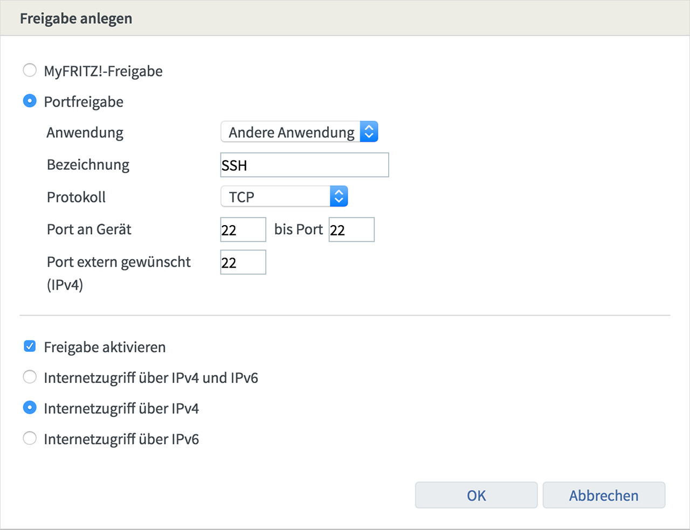

# Remote-Zugriff auf den Raspberry Pi
Zu allererst muss dass eigene Netzwerk von *aussen* erreichbar sein. Die dazu notwendigen Arbeiten sind hier [hier](./vorarbeiten.md) beschrieben.

Bevor der Raspberry nun von aussen erreichbar sein wird, muss er entsprechend abgesichert werden.

##	ssh für root ausschalten
Siehe z.B. [Securing Home Assistant](https://www.home-assistant.io/docs/configuration/securing) und [Sichere SSH Konfiguration](https://blog.buettner.xyz/sichere-ssh-konfiguration).
Dazu in der Datei `/etc/ssh/sshd_config` die Zeile `PermitRootLogin prohibit-password` aktivieren, so dass man sich per ssh auch bei Kenntnis des Kennwortes nicht als root anmelden darf.

>*Anmerkung: Bei mir war die Anmeldung auch vorher nicht möglich.*

## Portfreigabe in FRITZBox einrichten
Eine genaue Beschreibung findet sich [hier](https://avm.de/service/fritzbox/fritzbox-7390/wissensdatenbank/publication/show/893_Statische-Portfreigaben-einrichten/): Der Standartport für ssh ist 22; nach *aussen* kann man nun ebenfalls Port 22 freigeben oder einen beliebigen anderen freien Port wählen. Für VNC muss zusätzlich Port 5900 freigeben werden.


## nginx
Der Webserver [nginx](https://de.wikipedia.org/wiki/Nginx) kann u.a. auch als [Reverse-Proxy](https://de.wikipedia.org/wiki/Reverse_Proxy) zur Erhöhung der Sicherheit eingesetzt werden. Eine Beschreibung zur Installation findet sich [hier](https://howtoraspberrypi.com/install-nginx-raspbian-and-accelerate-your-raspberry-web-server).

```
sudo apt install nginx php-fpm
sudo nginx
```

>**Anmerkung** Ich hatte hier beim ersten Start eine Fehlermeldung:
```
nginx: [emerg] bind() to 0.0.0.0:80 failed (98: Address already in use)
nginx: [emerg] bind() to [::]:80 failed (98: Address already in use)
```
Tat es aber trotzdem... Falls nicht:
`sudo fuser 80/tcp` zeigt die Prozesse, die auf Port 80 zugreifen und `sudo fuser -k 80/tcp` stoppt die Prozesse.

Anschließend im Browser `http://localhost` aufrufen, um die Funktion zu überprüfen:


### Warum php-fpm?
By default, Nginx is not bound to PHP. During the development of Nginx, the choice was made to use PHP-FMP (a faster version of PHP) rather than a more traditional PHP. Therefore, we will install php-fpm to manage PHP files with Nginx.

## nginx starten beim booten
>**Anmerkung:** War bei mir auch ohne dies Kommando bereits autostart.

Ausführen des Kommandos: `sudo update-rc.d -f nginx defaults`

---

## NGINX als ReverseProxy konfigurieren
[Hier](https://www.smarthomeng.de/nginx-als-reverseproxy) und [hier](https://www.home-assistant.io/docs/ecosystem/certificates/lets_encrypt) gibt es eine sehr ausführliche Beschreibung, wie man sein Home Automation durch einen Reverse Proxy mit SSL-Zertifikat (siehe [hier](https://goneuland.de/debian-9-stretch-lets-encrypt-zertifikate-mit-certbot-erstellen/)) sichern kann.

Die im Repo vorhandene Version ist recht alt (Nov 18: v0.10.2). Daher nutze ich das Installationsskript. Darauf achten, dass Port 80 vorübergehend auf den Raspberry weitergeleitet wird (siehe [Portfreigabe](#portfreigabe-in-fritzbox-einrichten)).

Vor der Erstellung des Zertifikates sind noch einige Einstellungen zu machen:

Damit certbot die Identität überprüfen kann:

Mit `sudo nano /etc/nginx/snippets/letsencrypt.conf` eine Datei anlegen und folgenden Inhalt eingeben.
```
location ^~ /.well-known/acme-challenge/ {
 default_type "text/plain";
 root /var/www/letsencrypt;
}
```
Anschließend folgende Kommandos ausführen:
```
sudo mkdir -p /var/www/letsencrypt/.well-known/acme-challenge
sudo nano /etc/nginx/sites-available/default
```
Nun unterhalb von `listen [::]:80 default_server;` die Zeile `include /etc/nginx/snippets/letsencrypt.conf;`  einfügen.
```
server {
        listen 80 default_server;
        listen [::]:80 default_server;
        include /etc/nginx/snippets/letsencrypt.conf;
[...]
```
Nun mit `sudo service nginx restart` nginx neu starten.

### Zertifikat erzeugen
```
cd
mkdir certbot
cd certbot/
wget https://dl.eff.org/certbot-auto
chmod u+x certbot-auto

sudo ./certbot/certbot-auto certonly --rsa-key-size 4096 --webroot -w /var/www/letsencrypt --email <myMail> -d <myDNSName>
```

Beim ersten Aufruf wird hier die benötigte Software installiert und anschließend das Zertifikat herunter geladen. Mit dem Kommando `sudo ls -l /etc/letsencrypt/live` kann man überprüfen, dass ein Ordner mit dem Namen der eigenen dynDNS angelegt wurde.

Nun noch mit `sudo nano /etc/nginx/conf.d/<mydomain>.conf` die Konfigurationsdatei für die eigene Domäne erstellen. Hier der erste minimale Inhalt dieser Datei in Anlehnung an das oben erwähnte [Tutorial](https://www.smarthomeng.de/nginx-als-reverseproxy).

```
server {
    listen 443 ssl default_server;
    server_name <myDNSName>;

    ##
    # SSL
    ##
    ## Activate SSL, setze SERVER Zertifikat Informationen ##
    # Generiert via Let's Encrypt!
    ssl on;
    ssl_certificate /etc/letsencrypt/live/<myDNSName>/fullchain.pem;
    ssl_certificate_key /etc/letsencrypt/live/<myDNSName>/privkey.pem;
    ssl_session_cache builtin:1000 shared:SSL:10m;
    ssl_prefer_server_ciphers on;
    # unsichere SSL Ciphers deaktivieren!
    ssl_ciphers    HIGH:!aNULL:!eNULL:!LOW:!3DES:!MD5:!RC4;

    ##
    # HSTS
    ##
    add_header Strict-Transport-Security "max-age=31536000; includeSubDomains" always;

    ##
    # global
    ##
    root /var/www/<myDNSName>;
    index index.php index.htm index.html;

    # Weiterleitung von allen über https eingehenden Calls auf den nodejs-Testserver
    location / {
        proxy_pass      http://127.0.0.1:3000;
        proxy_buffering off;
    }
}
```
#### Zertifikat erneuern
Mit `sudo ./certbot/certbot-auto renew --dry-run` kann man testen, ob die automatische Erneuerung des Zertifikates funktionieren würde.


## GeoIP installieren und konfigurieren
Über GeoIP kann herausgefunden werden, aus welchem Land eine Anfrage kommt, so dass man bestimmte Länder zulassen oder blockieren kann.
```
sudo apt-get install geoip-database libgeoip1
cd /usr/share/GeoIP/
sudo wget http://geolite.maxmind.com/download/geoip/database/GeoLiteCountry/GeoIP.dat.gz
sudo gunzip GeoIP.dat.gz
```
Nun die Datei `/etc/nginx/nginx.conf` bearbeiten und direkt im „http“ Block die GeoIP Einstellungen hinzufügen:
```
    # GeoIP Settings
    # Nur Länder aus erlaubten IP Bereichen dürfen den ReverseProxy
    # passieren!
    # https://www.howtoforge.de/anleitung/nginx-besucher-mit-dem-geoip-modul-nach-landern-blocken-debianubuntu/
    ##
    geoip_country /usr/share/GeoIP/GeoIP.dat;
    map $geoip_country_code $allowed_country {
        default no;
        DE yes;
    }
```
>*Achtung:* Man kommt dann auch selbst nicht durch, wenn man sich im Ausland befindet.

Nun mit `sudo nano /etc/nginx/conf.d/<mydomain>.conf` die Konfigurationsdatei im Server-Block erweitern:
```
server {
    [...]
    ## Blocken, wenn Zugriff aus einem nicht erlaubten Land erfolgt ##
    if ($allowed_country = no) {
        return 444;
    }
    [...]
}
```
Nach dem Neustart von NGINX mit `sudo service nginx restart` ist die Änderung aktiv.

## Weitere Sicherungsmaßnahmen
[Hier](https://www.cyberciti.biz/tips/linux-unix-bsd-nginx-webserver-security.html) kann man einige Einstellungen zur Abwehr von bots, spammern und ähnlichem nachlesen. Es gilt die nginx-Konfigurationsdatei mit `sudo nano /etc/nginx/conf.d/<mydomain>.conf` im Server-Block zu erweitern:
```
if ($http_user_agent ~* LWP::Simple|BBBike|wget) {
    return 403;
}
if ($http_user_agent ~* msnbot|scrapbot) {
    return 403;
}
if ( $http_referer ~* (babes|forsale|girl|jewelry|love|nudit|organic|poker|porn|sex|teen) ) {
    return 403;
}
```

## Client Zertifikat
Für die Sicherung des Raspberry Pi durch Client-Zertifikate gibt es [hier](https://www.smarthomeng.de/nginx-als-reverseproxy) und [hier](https://medium.com/@pavelevstigneev/setting-nginx-with-letsencrypt-and-client-ssl-certificates-3ae608bb0e66) hilfreiche Anleitungen.

>**Anmerkung:** *pi* in den Dateinamen (z.B. *pi.key* ist beliebig gewählt.

Erstellung eines eigenen rootca-Zertifikates-Privatekeys mit 4096 bit Schlüssellänge und Encryption des erstellten privaten Keys mit einem Kennwort:

`sudo openssl genrsa -des3 -out /etc/ssl/ca/private/ca.key 4096`

Erstellen eines Serverzertifikats mit 3 Jahren Gültigkeit:

`sudo openssl req -new -x509 -days 1095 -key /etc/ssl/ca/private/ca.key -out /etc/ssl/ca/certs/ca.crt`

Erstellen eines Keys für einen ersten Client. - Hier 4096 oder nur 1024

`sudo openssl genrsa -des3 -out /etc/ssl/ca/certs/users/pi.key 1024`

Für den soeben erstellten Client-Key erstellen wir nun eine Zertifikatsanforderung (CSR):

`sudo openssl req -new -key /etc/ssl/ca/certs/users/pi.key -out /etc/ssl/ca/certs/users/pi.csr`

Jetzt signieren wir die Zertifikatsanforderung (CSR) des Clients gegen unser Serverzertifikat und erstellen ein Client-Zertifikat:

`sudo openssl x509 -req -days 1095 -in /etc/ssl/ca/certs/users/pi.csr -CA /etc/ssl/ca/certs/ca.crt -CAkey /etc/ssl/ca/private/ca.key -CAserial /etc/ssl/ca/serial -CAcreateserial -out /etc/ssl/ca/certs/users/pi.crt`

Abschließend exportieren wir das Clientzertifikat und den Key übertragungstauglich in PKCS12-Format:
```
sudo openssl pkcs12 -export -clcerts -in /etc/ssl/ca/certs/users/pi.crt -inkey /etc/ssl/ca/certs/users/pi.key -out /etc/ssl/ca/certs/users/pi.p12

sudo cp /etc/ssl/ca/certs/users/pi.p12 /home/pi
cd /home/pi/
sudo chown pi pi.p12
```
