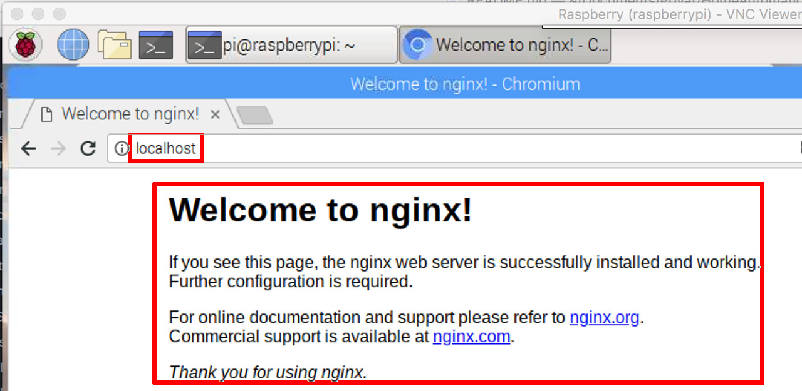

# Security
## ssh
###	ssh für root ausschalten
Siehe z.B. [Securing Home Assistant](https://www.home-assistant.io/docs/configuration/securing), [Sichere SSH Konfiguration](https://blog.buettner.xyz/sichere-ssh-konfiguration) und [Absicherung eines Debian Servers](https://www.thomas-krenn.com/de/wiki/Absicherung_eines_Debian_Servers#SSH_Konfiguration).
> *Anmerkung: Falls ssh nicht installiert ist, mit `sudo apt-get install ssh` installieren. Sollte der Dienst sich nicht automatisch starten, den Befehl `sudo update-rc.d ssh defaults` ausführen.*

Um den login für den Nutzer root zu deaktivieren, wird in der Datei `/etc/ssh/sshd_config` die Zeile `PermitRootLogin prohibit-password` aktiviert; nun ist auch bei Kenntnis des root-Kennwortes keine Anmeldung über ssh möglich.
> *Anmerkung: Bei mir war die Anmeldung auch vorher nicht möglich.*

### ssh Standartport 22 verändern
In der Konfigurationsdatei `/etc/ssh/sshd_config` einen Port oberhalb von 1023 eintragen.
```
[...]
Port 53122
#AddressFamily any
[...]
```
Nun noch mit `sudo service ssh restart` den ssh-Dämon neu starten, damit die geänderte Konfiguration aktiv wird. Ab jetzt muss bei jedem Remote Login der Port mit angegeben werden:  
`ssh pi@192.168.178.111 -p 53122`

### OpenSSH Public Key Authentifizierung konfigurieren
Zuerst wird auf dem Client das Schlüsselpaar - bestehend aus public und private key - generiert und anschließend der public key zum Server übertragen. Der Private Schlüssel sollte mit einem Kennwort gesichert werden.

Schlüsselpaar generieren:  
`ssh-keygen -b 4096 -f ~/.ssh/pi_rsa`

Öffentlichen Schlüssel auf den Ziel-Server übertragen:  
`ssh-copy-id -i ~/.ssh/pi_rsa.pub -p 53122 pi@192.168.178.111`

#### Privaten Schlüssel in keychain speichern
Da es lästig ist, immer wieder das Kennwort für den private key eingeben zu müssen, kann man diesen in der keychain des eigenen Clients speichern. Unter MacOS sieht geschieht dies mit:  
`ssh-add -K ~/.ssh/pi_rsa`

Von nun ist es möglich, von diesem Client den Pi ohne Eingabe eines Kennwortes zu erreichen. Auch das _passende_ Zertifikat wird automatisch _gefunden_:
```
ssh -p 53122 pi@192.168.178.111
sftp -P 53122 pi@192.168.178.111
scp -P 53122 /tmp/tst pi@192.168.178.111:/tmp/tst
```

### ssh-login mit Kennwort deaktivieren
>*Achtung:* Wenn dies durchgeführt ist, kann man den Pi über ssh nicht mehr ohne die Private-Key-Datei erreichen!

In der Konfigurationsdatei `/etc/ssh/sshd_config` den Schlüssel `PasswordAuthentication` auf `no` setzen.
```
[...]
# To disable tunneled clear text passwords, change to no here!
PasswordAuthentication no
#PermitEmptyPasswords no
[...]
```

Nun wie schon bekannt, den ssh-Dämon neu starten:  
`sudo service ssh restart`

Ein Anmeldeversuch von einem Rechner ohne Zertifikat führt nun zu:  
`pi@192.168.178.111: Permission denied (publickey).`

Wenn man nun einen weiteren Client zulassen möchte, muss man kurzfristig den ssh-login mit Kennwort wieder aktivieren.

---
## Reverse Proxy mit nginx
### nginx installieren
Der Webserver [nginx](https://de.wikipedia.org/wiki/Nginx) kann u.a. auch als [Reverse-Proxy](https://de.wikipedia.org/wiki/Reverse_Proxy) zur Erhöhung der Sicherheit eingesetzt werden. Eine Beschreibung zur Installation findet sich z.B.  [hier](https://howtoraspberrypi.com/install-nginx-raspbian-and-accelerate-your-raspberry-web-server).
```
sudo apt install nginx php-fpm
sudo nginx
```

>**Anmerkung** Ich hatte hier beim ersten Start eine Fehlermeldung:
```
nginx: [emerg] bind() to 0.0.0.0:80 failed (98: Address already in use)
nginx: [emerg] bind() to [::]:80 failed (98: Address already in use)
```
Tat es aber trotzdem... Falls nicht:
`sudo fuser 80/tcp` zeigt die Prozesse, die auf Port 80 zugreifen und `sudo fuser -k 80/tcp` stoppt die Prozesse.

Anschließend auf dem Pi im Browser `http://localhost` oder auf dem Client `http://192.168.178.111` aufrufen, um die Funktion zu überprüfen:


#### Warum php-fpm?
In den Paketrepositories ist Nginx nicht an PHP gebunden. Bei der Entwicklung von Nginx wurde die Entscheidung getroffen, PHP-FMP (eine schnellere Version von PHP) anstelle eines herkömmlicheren PHP zu verwenden. Daher werden wir php-fpm installieren, um PHP-Dateien mit Nginx zu verwalten.

### nginx auf aktuellere Version bringen
Im November 2018 war im Raspbian-Paketrepository eine ziemlich alte nginx-Version **(v1.10)** verfügbar. Zwischenzeitlich gibt es neue Versionen, die vermeintlich schneller und sicherer seien. Allerdings ist die aktuelle Version **(v1.14.1)** nicht ganz so einfach zu installieren, da man hierfür den **testing branch** von **Raspbian** den Paketquellen hinzufügen muss. Eine Beschreibung der Installation habe ich [hier](https://getgrav.org/blog/raspberrypi-nginx-php7-dev) gefunden.

Anlegen der Datei `/etc/apt/sources.list.d/10-buster.list` mit folgendem Inhalt:  
`deb http://mirrordirector.raspbian.org/raspbian/ buster main contrib non-free rpi`

Anlegen der Datei `/etc/apt/sources.list.d/10-buster` mit folgendem Inhalt:  
```
Package: *
Pin: release n=stretch
Pin-Priority: 900

Package: *
Pin: release n=buster
Pin-Priority: 750
```

Die Installation erfolgt mit den nachstehenden Kommandos. Hierbei habe ich alle Default-Werte akzeptiert
```shell
sudo apt-get update
sudo apt-get install -t buster nginx
```

Bei mir ist Installation nicht _glatt_ durchgelaufen; zwei der Meldungen habe ich mir zur Sicherheit [hier](./nginx_update_errors.md) aufgehoben.
