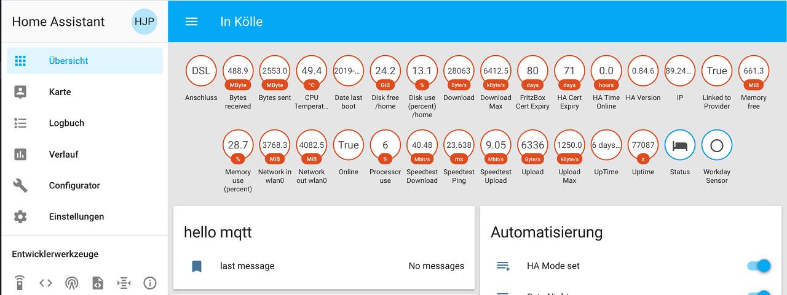

# Sensoren
## System Monitor
Die ersten Sensoren, die man zur Verfügung hat, sind die, die der Raspberry Pi - genauer das Betriebssystem - selbst zu Verfügung stellt und die dabei helfen, den Systemzustand im Auge zu behalten. Die verfügbaren Sensoren sind (größtenteils) in der [systemmonitor-Plattform](https://www.home-assistant.io/components/sensor.systemmonitor) zusammen gestellt.


Um diese Sensoren zu aktivieren/darzustellen, müssen die Dateien `sensors.yaml` und `groups.yaml` wie folgt erweitert werden:  
`sensors.yaml`:
```
####################################################
# Raspberry PI system Monitoring                   #
####################################################
  - platform: systemmonitor
    resources:
      - type: processor_use
      - type: memory_use_percent
      - type: memory_free
      - type: disk_use_percent
        arg: /home
      - type: disk_free
        arg: /home
      - type: last_boot
        #hidden: true
      - type: network_in
        arg: wlan0
      - type: network_out
        arg: wlan0

  - platform: template
    sensors:
      date_last_boot:
        friendly_name: "Nice last boot"
        value_template: '{{ states.sensor.last_boot.state.split("T")[0] }}'

  - platform: command_line
    name: CPU Temperature
    command: "cat /sys/class/thermal/thermal_zone0/temp"
    # If errors occur, remove degree symbol below
    unit_of_measurement: "°C"
    value_template: '{{ value | multiply(0.001) | round(1) }}'
```
Nach dem Neustart des HA sind die Sensoren in der Übersichtszeile sichtbar:


Damit die Sensoren, wie weiter oben dargestellt, gesammelt in einem Widget dargestellt werden, müssen diese gruppiert werden:  
`groups.yaml`
```
System_Info:                        # Group for RaspberryPi System Information
    name: System Info
    entities:
    - sensor.CPU_Temperature
    - sensor.processor_use
    - sensor.memory_use_percent
    - sensor.memory_free
    - sensor.disk_use_percent_home
    - sensor.disk_free_home
    - sensor.network_in_wlan0
    - sensor.network_out_wlan0
    - sensor.date_last_boot
    - sensor.ha_version
```
