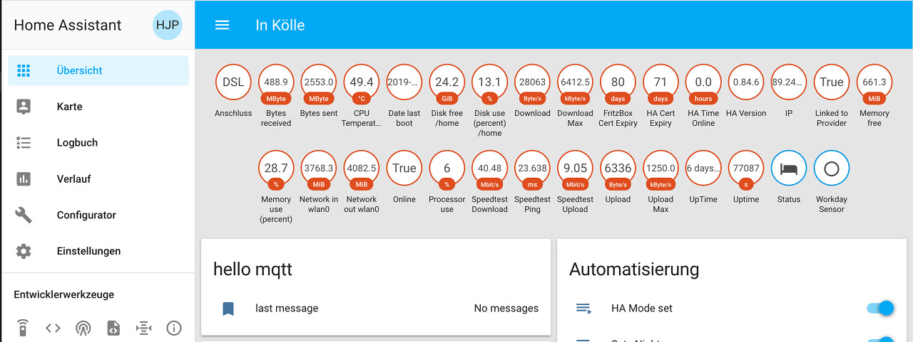

# Sensoren
## System Monitor
Die ersten Sensoren, die man zur Verfügung hat, sind die, die der Raspberry Pi - genauer das Betriebssystem - selbst zu Verfügung stellt und die dabei helfen, den Systemzustand im Auge zu behalten. Die verfügbaren Sensoren sind (größtenteils) in der [systemmonitor-Plattform](https://www.home-assistant.io/components/sensor.systemmonitor) zusammen gestellt.  


Um diese Sensoren zu aktivieren/darzustellen, müssen die Dateien `sensors.yaml` und `groups.yaml` wie folgt erweitert werden:  
`sensors.yaml`:
```
####################################################
# Raspberry PI system Monitoring                   #
####################################################
  - platform: systemmonitor
    resources:
      - type: processor_use         # Processur use in %
      - type: memory_use_percent    # Memory used in %
      - type: memory_free           # Memory free in MB
      - type: disk_use_percent      # Disk used in %
        arg: /home                  # arg does really not matter because all folders are in / filesystem located on SD card
      - type: disk_free             # Disk free in MB
        arg: /home
      - type: last_boot             # Time of last boot - needed for template sensor date_last_boot
        #hidden: true               # If hidden, the date_last_boot sensor shows unknown
      - type: network_in            # Network trafic in MB
        arg: wlan0
      - type: network_out
        arg: wlan0                  # Network trafic in MB
  - platform: template
    sensors:
      date_last_boot:               # Last boot in a nicer format: yyyy-mm-dd
        friendly_name: "Date last boot"
        value_template: '{{ states.sensor.last_boot.state.split("T")[0] }}'
```

Nach dem Neustart des HA sind die Sensoren (im Bild sind weitere Sensoren enthalten) in der Übersichtszeile sichtbar:  


Damit Sensoren, wie im unteren Teil des Bildes angedeutet, gesammelt in einer Gruppe dargestellt werden, müssen diese gruppiert werden. Wie das geht, ist [hier](../homeassistant_groups_tabs.md) beschrieben.  
