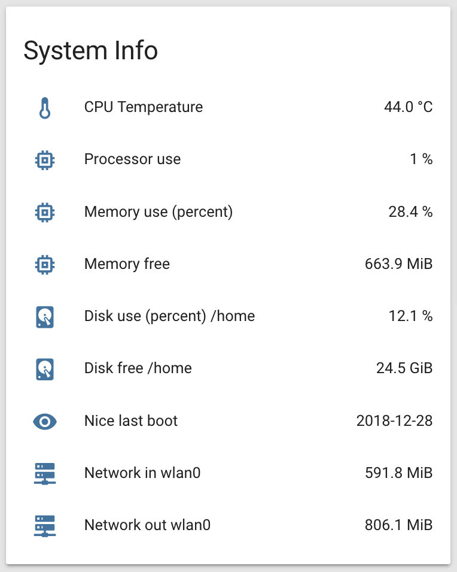

# Sensoren zum Monitoren des Raspberry Pis, der Fritzbox und des Netzwerkes
Generell sind Sensoren im Bereich `sensor:` in der Datei `configuration.yaml` einzutragen. Um die Übersichtlichkeit zu verbessern, kann man Sensoren in eigene Dateien eintragen und diese in der Datei `configuration.yaml` einlesen. Um dann alle Dateien im Unterverzeichnis `sensors` einzulesen, ist folgende Zeile in die Datei `configuration.yaml` einzutragen:  
```
sensor: !include_dir_merge_list sensors
```

## Home Assistant System
### Größe der Home Assistant Datenbank
Um die Größe der Home Assistant zu beobachten, gibt es den [filesize-Sensor](https://www.home-assistant.io/components/sensor.filesize/). Dieser wird in der im Sensors-Bereich der Datei configurations.yaml aktiviert:
```
- platform: filesize
  file_paths:
    - /home/homeassistant/.homeassistant/home-assistant_v2.db
```
Damit das System auf die Datei zugreifen kann, muss das Verzeichnis noch in die Whitelist (Datei configurations.yaml) eingetragen werden:
```
whitelist_external_dirs:
  -  /home/homeassistant/.homeassistant
```

### Version von Home Assistant und Zeit-online
```
- platform: version                   # Home Assistant Software Version
  name: 'HA Version'
  scan_interval: 3600                 # Aktualisieren jede Stunde
- platform: uptime                    # Onlinezeit der HA-Anwendung in Stunden
  name: 'HA Time Online'
  unit_of_measurement: hours
  scan_interval: 3600                 # Aktualisieren jede Stunde
```

## Raspberry Pi
### Sensor System Monitor
Die ersten Sensoren, die man zur Verfügung hat, sind die, die der Raspberry Pi - genauer das Betriebssystem - selbst zur Verfügung stellt und die dabei helfen, den Systemzustand im Auge zu behalten. Die verfügbaren Sensoren sind (größtenteils) in der [systemmonitor-Plattform](https://www.home-assistant.io/components/sensor.systemmonitor) zusammen gestellt.  


Um diese Sensoren zu aktivieren/darzustellen, müssen die Dateien `sensors/sensors_systeminfo.yaml` und `groups.yaml` wie folgt erweitert werden:  
`sensors/sensors_systeminfo.yaml`:
```
####################################################
# Raspberry PI system Monitoring                   #
####################################################
  - platform: systemmonitor
    resources:
      - type: processor_use         # Processur use in %
      - type: memory_use_percent    # Memory used in %
      - type: memory_free           # Memory free in MB
      - type: disk_use_percent      # Disk used in %
        arg: /home                  # arg does really not matter because all folders are in / filesystem located on SD card
      - type: disk_free             # Disk free in MB
        arg: /home
      - type: last_boot             # Time of last boot - needed for template sensor date_last_boot
        #hidden: true               # If hidden, the date_last_boot sensor shows unknown
      - type: network_in            # Network trafic in MB
        arg: wlan0
      - type: network_out
        arg: wlan0                  # Network trafic in MB
  - platform: template
    sensors:
      date_last_boot:               # Last boot in a nicer format: yyyy-mm-dd
        friendly_name: "Date last boot"
        value_template: '{{ states.sensor.last_boot.state.split("T")[0] }}'
```

Nach dem Neustart des HA sind die Sensoren (im Bild sind weitere Sensoren enthalten) in der Übersichtszeile sichtbar:  


Damit Sensoren, wie im unteren Teil des Bildes angedeutet, gesammelt in einer Gruppe dargestellt werden, müssen diese gruppiert werden. Wie das geht, ist [hier](../homeassistant_groups_tabs.md) beschrieben.  

### Sensor command line
Mit dem [Command Line Sensor](https://www.home-assistant.io/components/sensor.command_line/) kann man CLI-Kommandos ausführen und die Ausgabe als Sensorwert in das HA-System übernehmen. Auf diese Weise lässt sich z.B. die CPU-Temperatur oder die Uptime des Raspis auslesen. Hier die notwendigen Einträge:
`sensors/sensors.yaml`:
```
- platform: command_line
  name: CPU Temperature           # CPU Temperatur in °C
  command: "cat /sys/class/thermal/thermal_zone0/temp"
  unit_of_measurement: "°C"       # If errors occur, remove degree symbol
  value_template: '{{ value | multiply(0.001) | round(1) }}'
- platform: command_line
  name: UpTime                    # PIs uptime in days
  command: uptime | awk -F'( |,|:)+' '{print $6, $7 ", ", $8, "h"}'
  scan_interval: 3600
  icon: mdi:clock
#  - platform: command_line
#    Does not make so much sense; it's allmost 600 with some peaks at 1400
#    name: CPU Speed                 # Current CPU frequency
#    command: "cat /sys/devices/system/cpu/cpu0/cpufreq/scaling_cur_freq"
#    unit_of_measurement: "MHz"
#    value_template: '{{ value | multiply(0.001) | round(0) }}'
#    scan_interval: 10
```
Hier ein Beispiel für die Ausgabe des Temperatur-Sensors. Um einen solchen Graphen zu erhalten, ist es wichtig, den Parameter `unit_of_measurement` zu pflegen.   


### Sensor Certificate expiry
Let's Encrypt Zertifikate haben ein Gültigkeit von 90 Tagen und müssen regelmäßig erneuert werden. Die [Fritz!Box](../fritzbox.md#Certificate) macht dies automatisch; das Zertifikat für den [nginx Reverse Proxy](../nginx.md) muss selbst erneuert werden (dies kann natürlich auch per crontab automatisiert werden).
Der angeführte Sensor zeigt die Tage bis zum Ablauf des entsprechenden Zertifikates an:  
`sensors/sensors.yaml`:
```
- platform: cert_expiry           # LetsEncrypt Certificate expiry for Home Assistant
  name: "HA Cert Expiry"
  host: xxxxxxxxxxxxxxxx.myfritz.net
  port: 443
  scan_interval: 21600            # Aktualisieren alle 6 Stunden
```
Soll z.B. auch die Gültigkeit für das Zertifikat der Fritzbox angezeigt werden, muss einfach ein weiterer Eintrag ergänzt werden (Standardport für Fritzbox-Webinterface: 44478).

## Fritz!Box
### Sensor fritzbox_netmonitor
Über den [FRITZ!Box Net Monitor](https://www.home-assistant.io/components/sensor.fritzbox_netmonitor/) lassen sich Netzwerkstatistiken von der Fritzbox abrufen. Bevor der Sensor verwendet werden kann, muss zusätzliche Software auf dem Raspi installiert werden.  
```
sudo apt-get install libxslt-dev libxml2-dev python3-lxml
sudo apt-get install libxml2-dev libxslt1-dev # War in meiner history. Ob hierbei was installiert wurde, weiß ich nicht mehr
```

Anschließend im virtualenv:  
```
cd /srv/homeassistant
source bin/activate
pip3 install lxml
```

> Bei mir hatte dieses Kommando beim ersten mal nicht funktioniert. Ein paar Tage später ging es auf einmal...

Dieser Sensor besteht aus _einem_ Sensor mit mehreren Attributen. Deshalb wird der Sensor selbst mit `hidden: true` auf nicht anzeigen gestellt. Anschließend werden die einzelnen Attribute mit `value_templates` einzeln angezeigt und ggf. noch umgerechnet.

`sensors/sensors.yaml`:  
```
- platform: fritzbox_netmonitor
  hidden: true
- platform: template
  sensors:
    fritz_is_linked:
      friendly_name: "Linked to Provider"
      value_template: "{{ states.sensor.fritz_netmonitor.attributes.is_linked }}"
      icon_template: mdi:earth
    fritz_is_connected:
      friendly_name: "Online"
      value_template: "{{ states.sensor.fritz_netmonitor.attributes.is_connected }}"
      icon_template: mdi:earth
    fritz_wan_access_type:
      friendly_name: "Anschluss"
      value_template: "{{ states.sensor.fritz_netmonitor.attributes.wan_access_type }}"
      icon_template: mdi:ethernet-cable
    fritz_external_ip:
      friendly_name: "IP"
      value_template: "{{ states.sensor.fritz_netmonitor.attributes.external_ip }}"
      icon_template: mdi:link
    fritz_uptime:
      friendly_name: "Uptime"
      value_template: "{{ states.sensor.fritz_netmonitor.attributes.uptime }}"
      icon_template: mdi:clock
      unit_of_measurement: s
    fritz_bytes_sent:
      friendly_name: "Bytes sent"
      value_template: "{{ states.sensor.fritz_netmonitor.attributes.bytes_sent | multiply(0.000001) | round(1) }}"
      icon_template: mdi:arrow-up-bold
      unit_of_measurement: MByte
    fritz_bytes_received:
      friendly_name: "Bytes received"
      value_template: "{{ states.sensor.fritz_netmonitor.attributes.bytes_received | multiply(0.000001) | round(1) }}"
      icon_template: mdi:arrow-down-bold
      unit_of_measurement: MByte
    fritz_rate_up:
      friendly_name: "Upload"
      value_template: "{{ states.sensor.fritz_netmonitor.attributes.transmission_rate_up }}"
      icon_template: mdi:arrow-up-bold
      unit_of_measurement: Byte/s
    fritz_rate_down:
      friendly_name: "Download"
      value_template: "{{ states.sensor.fritz_netmonitor.attributes.transmission_rate_down }}"
      icon_template: mdi:arrow-down-bold
      unit_of_measurement: Byte/s
    fritz_rate_up_max:
      friendly_name: "Upload Max"
      value_template: "{{ states.sensor.fritz_netmonitor.attributes.max_byte_rate_up | multiply(0.001) | round(1) }}"
      icon_template: mdi:arrow-up-bold
      unit_of_measurement: kByte/s
    fritz_rate_down_max:
      friendly_name: "Download Max"
      value_template: "{{ states.sensor.fritz_netmonitor.attributes.max_byte_rate_down | multiply(0.001) | round(1) }}"
      icon_template: mdi:arrow-down-bold
      unit_of_measurement: kByte/s
```

## Netzwerk
### Sensor speedtest.net
Der [Speedtest.net](https://www.home-assistant.io/components/sensor.speedtest/) Sensor misst die Bandbreite und die Performance des Netzwerkes. Die Konfiguration ist recht einfach; jedoch sollte man bedenken, dass die Tests relativ viel Datenvolumen (ca. 40 MB download und ca 10 MB upload) produzieren, während der Zeit der Test das Netzwerk voll auslasten und auch erheblich Speicher auf dem Raspi belegen. Daher führe ich den Test zum Ausprobieren 5 mal pro Tag aus:

`sensors/sensors.yaml`:  
```
  - platform: speedtest
    server_id: 6670
    hour:
    - 07
    - 11
    - 15
    - 19
    - 23
    minute:
    - 58
    monitored_conditions:
      - ping
      - download
      - upload
    value_template: '{{ value | round(0) }}'  
```

Das Ergebnis schaut bei mir dann so aus:  

