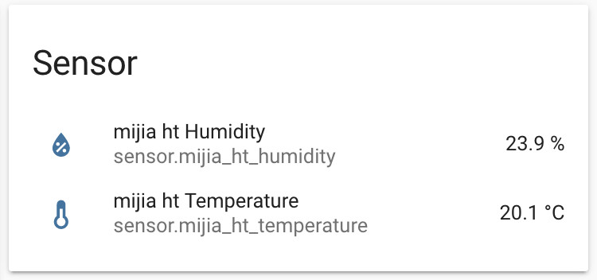

# Xiaomi Mijia BT Hygrothermo - Temperatur- und Luftfeuchtigkeitssensor
[Hier](https://github.com/dolezsa/Xiaomi_Hygrothermo) gibt es die benötigte `sensor.py`-Datei. Diese kopiert man in das Verzeichnis `/home/homeassistant/.homeassistant/custom_components/xiaomi_hygrothermo`.  
Wie die Mac-Adresse des Sensors bestimmt wird, steht ebenfalls in dem obigen Link beschrieben:
```
$ sudo hcitool lescan
LE Scan ...
LE Scan ...
4C:65:A8:xx:xx:xx (unknown)
4C:65:A8:xx:xx:xx MJ_HT_V1
[...]
```

Anschließend muss man den Sensor noch bekannt machen, indem man in die Datei `sensors.yaml` folgenden Eintrag einfügt:
```
- platform: xiaomi_hygrothermo
  name: mijia ht #1
  mac: '4C:65:A8:DD:FF:D3'
  scan_interval: 60
```

Nach dem Restart erscheinen die Sensoren:


Warum der Batterie-Zustand nicht angezeigt wird, weiß ich noch nicht...
