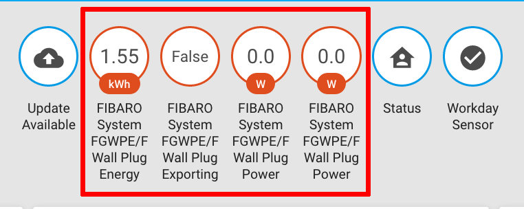

# zwave Netzwerk konfigurieren

Um das zwave-Netzwerk zu konfigurieren, habe ich nachfolgende Kommandos - wie [hier](https://www.home-assistant.io/docs/z-wave/installation/) und [hier](https://blog.mornati.net/install-zwave-home-assistant/)  beschrieben  - ausgeführt. Ob dies tatsächlich notwendig war, weiß ich nicht (im zweiten Link ist davon nicht die Rede).  
`apt-get update` musste ich ausführen, weil nach dem ersten Aufruf des `apt-get install` ein Fehler aufgetreten ist. Mit `raspi-config` (Auswahl 5 / P6) wird die serielle Schnittstelle aktiviert.

```
sudo apt-get update --fix-missing
sudo apt-get install libudev-dev

sudo raspi-config                 # Enable serial interface

ls -ltr /dev/tty*|tail -n 1       # Display Path of Z-Wave USB stick

cat /dev/urandom | tr -dc '0-9A-F' | fold -w 32 | head -n 1 | sed -e 's/\(..\)/0x\1, /g' -e 's/, $//' # Generate a random network_key
```

Um den Stick beim HA bekannt zu machen, muss noch die Datei `configuration.yaml` erweitert werden:  
```
zwave:
  usb_path: /dev/ttyACM0
  debug: true
  network_key: "0xDD, 0x22, 0xA9, 0x64, 0xE1, 0x20, 0x00, 0xC7, 0x5A, 0x95, 0xB1, 0x05, 0x26, 0x33, 0xC1, 0x7C"
```

##	Einbinden des Fibaro-Zwischensteckers
Eine Beschreibung dazu findet sich z.B. [hier](http://homeassistant.jan-kuepper.de/fibaro-wall-plug-fgwpf-102-in-home-assistant-einbinden).  
- USB-Stick aus dem RPi nehmen.
- Den Knopf einmal drücken.
- Beim Fibaro den kleinen Knopf drei mal schnell drücken.  
Der Stick blinkt zweimal schnell und die beiden sind gekoppelt.
- Stick wieder in den RPi und das neue Gerät ist sichtbar.

Wenn man nun die HA öffnet, finden sich die neuen Sensoren in der Übersicht, sowie ein Schalter in der Gruppe "Schalter":  
  
> Beim zweiten Anlauf musste ich den Schalter zuerst wieder _entlernen_, das HA restarten. den Stick rausziehen, ... bevor der Schalter selbst sichtbar war.
