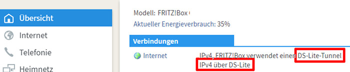
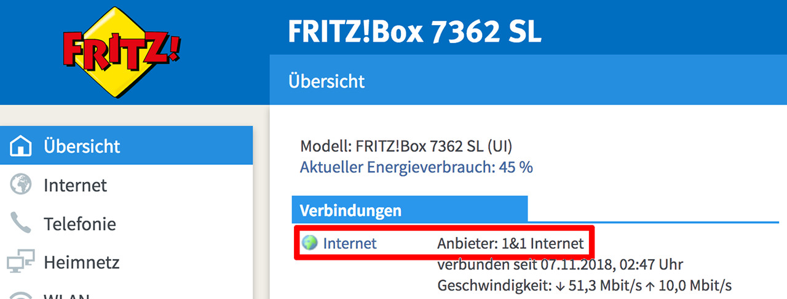
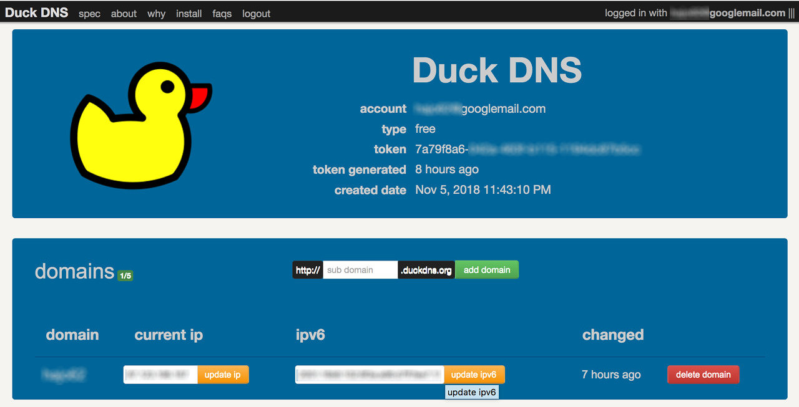

# Vorarbeiten
## Heimnetz von außen erreichbar machen
### DS-Lite-Tunnel
Mein Internet-Provider [1&amp;1](http://www.1und1.de/) hatte meinen DSL-Anschluss vor einiger Zeit auf einen  [DS-Lite-Tunnel](https://de.wikipedia.org/wiki/IPv6#Dual-Stack_Lite_(DS-Lite)) umgestellt. Dadurch wurde meinem Anschluss keine IPv4-IP-Adresse mehr zugeteilt und ein im Heimnetz betriebener Rechner ist von außen nicht über das IPv4-Netz erreichbar. (Siehe dazu z.B. [hier](https://avm.de/service/fritzbox/fritzbox-7490/wissensdatenbank/publication/show/1611_Was-ist-DS-Lite-und-wie-funktioniert-es/)). Abhilfe würde hier ein [4in6-Tunnel](https://de.wikipedia.org/wiki/4in6) schaffen. Da die 4in6-Tunnel-Anbieter **sixXS** oder **gogo6** ihre Dienste eingestellt haben, scheinen solche Tunnel nicht mehr verfügbar zu sein.

Erstaunlicherweise genügte aber ein Anruf bei der Hotline (+49 721 9600) und mein Anschluss wurde nach wenigen Minuten auf einen *vollen* DSL-Anschluss mit dynamischer IPv4-Adresse umgestellt.

### Internetzugriff auf der Fritzbox aktivieren
Unter `Internet / My!FRITZ-Konto` muss ein **MyFRITZ!-Konto** eingerichtet und anschließend die Option **MyFRITZ!-Internetzugriff** aktiviert werden.

Nun ist die Fritzbox von außen erreichbar.

####	Certificate
Die Browser-Verbindung auf die Fritzbox ist über ein **Self-Signed-Certificate** gesichert; bei jedem ersten Browser-Zugriff gibt es eine Sicherheits-Warnung. Um die Warnung zu Umgehen bietet die Fritzbox die Möglichkeit, ein Certficate von [letsencrypt.org](https://letsencrypt.org) zu holen und automatisch alles 60 Tage zu erneuern.

Dazu unter `Internet/MyFRITZ-Konto` `Zertifikat von letsencrypt.org verwenden` aktivieren.

### DynDNS

Da einem privaten DSL-Anschluss meist keine feste IP-Adresse zugeordnet ist und diese sich bei jedem Verbindungsneuaufbau ändern kann, ist es notwendig, meinem Netz über [**dynDNS**](https://de.wikipedia.org/wiki/Dynamisches_DNS) einen festen Domain-Namen zuzuweisen (&quot;Dynamic Updates in the Domain Name System (DNS UPDATE)&quot;).

Die einfachste Möglichkeit bietet hier gleich die Fritzbox selbst; im Feld `Ihre MyFRITZ!-Adresse` wird der generierte Name angezeigt.

Sollte einem die kryptische Domain nicht zusagen, kann man über einen dynDNS-ANbieter eine sprechendere Domain erstellen. (Weitere Unterschiede bzw. Vor- oder Nachteile sind mir nicht bekannt).

#### dynDNS von Internetanbietern

Der Anbieter [DuckDNS](http://duckdns.org) ist kostenlos und man sich ohne einen weiteren Account anlegen und sich merken zu müssen, einfach z.B. mit seiner googlemail-Adresse anmelden.

Nun einfach eine Domain (z.B. 
https://mydomain.duckdns.org/div>) erzeugen und die IPv4- und/oder IPv6-Adresse eintragen. Anschließend kann man die Verbindung mit `ping <mydomain>.duckdns.org` prüfen.

Damit die geänderten IP-Adressen dem dynDNS-Dienst bekannt gegeben werden, muss in der Fritzbox unter `Internet / Freigaben / DynDNS`  noch die Update-Url (z.B. https://www.duckdns.org/update?domains=mydomain.duckdns.org&<token=token-von-dyndns>&amp.ip=<ipaddr>&amp.ipv6=<ip6addr>) hinterlegt werden.
[Hier](https://8300111.de/fritzbox-mit-os-6-60-dynamic-dns-mit-duck-dns-einrichten-schnell-und-kostenlos) findet sich dazu eine kurze Beschreibung.
